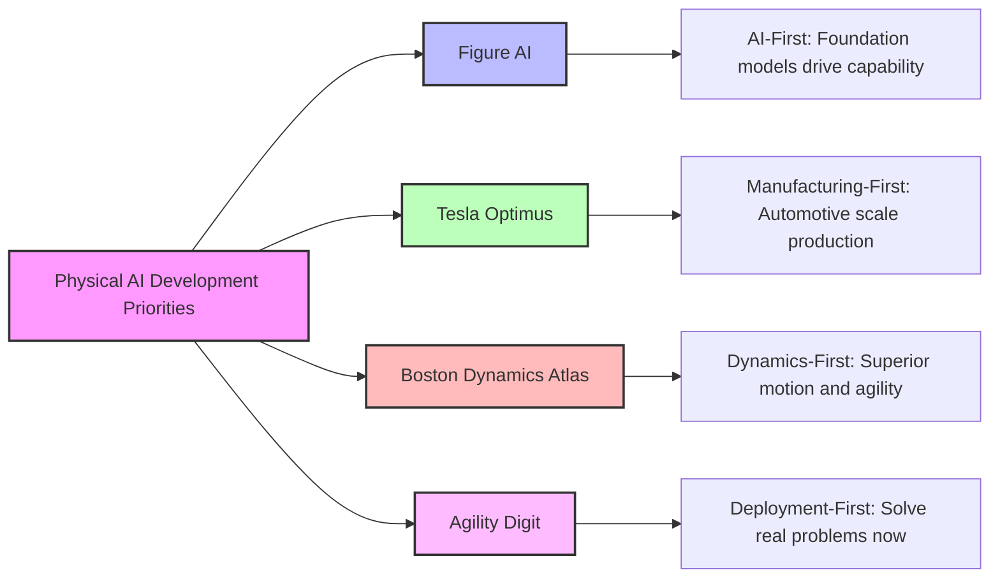
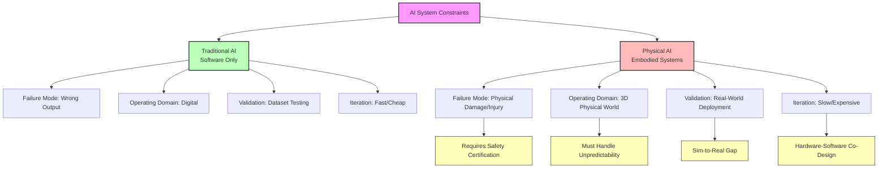

# Chapter 0.1 — Why Physical AI Is the Next Frontier

## Learning Objectives

By the end of this chapter, you will be able to:

- **Define** Physical AI and explain how it differs from traditional artificial intelligence
- **Identify** the five major opportunity domains where Physical AI is creating real-world impact in 2025
- **Recognize** the three unique technical challenges that make Physical AI fundamentally different from software-only AI systems
- **Evaluate** why 2025 represents a breakthrough year for humanoid robotics and autonomous physical systems
- **Describe** the current landscape of leading Physical AI companies and their technological approaches

## Why This Matters in 2025

You've seen ChatGPT write essays, generate code, and answer questions. You've watched image generators create stunning artwork. But here's the reality: all of that happens in pixels on a screen. Physical AI is different. It's about machines that can fold your laundry, assemble a car, harvest crops, or help an elderly person stand up. In 2025, we're witnessing the moment when AI finally breaks free from the digital world and enters the physical one. Companies like Figure AI, Tesla, Boston Dynamics, and Agility Robotics aren't building prototypes anymore—they're building factories that will produce tens of thousands of robots this year. Understanding Physical AI isn't about predicting the future. It's about understanding the present that's unfolding right now.

## What Is Physical AI?

### The Simple Definition

**Physical AI** refers to artificial intelligence models that can perceive, reason about, and physically interact with the real world through motor skills and embodied action.

### The Technical Explanation

While traditional AI systems process information and generate digital outputs (text, images, predictions), Physical AI systems close the loop between perception and action in three-dimensional space. These systems integrate:

1. **Perception subsystems** — Sensors (cameras, LiDAR, force sensors) that capture the state of the physical environment
2. **Reasoning engines** — AI models that interpret sensory data and plan actions to achieve goals
3. **Action mechanisms** — Motors, actuators, and manipulators that execute physical tasks in the real world
4. **Feedback loops** — Real-time control systems that adjust actions based on how the environment responds

Physical AI systems are housed in autonomous machines such as humanoid robots, robotic arms, autonomous vehicles, and mobile manipulation platforms. The key distinguishing factor is **embodiment**—the AI doesn't just think or generate outputs; it physically acts on the world and experiences the consequences of those actions.

### A Real-World Analogy

Think of the difference between a chess computer and a robot that can physically move chess pieces on a real board. The chess computer can be a grandmaster—it can calculate millions of positions per second and beat any human player. But it cannot pick up a pawn and move it two squares forward. Physical AI is the difference between knowing what to do and being able to actually do it in the messy, unpredictable physical world.

## Why 2025 Is the Breakthrough Year

### From Research Labs to Factory Floors

For decades, advanced robotics lived primarily in university research labs and military R&D programs. The robots were impressive in controlled settings but struggled with the variability and chaos of real-world environments. Three factors converged in 2024-2025 to change this:

**1. Vision-Language-Action (VLA) Models**

The same transformer architectures that powered ChatGPT and GPT-4 have been adapted to robotics. Instead of predicting the next word in a sentence, these models predict the next action a robot should take based on visual input and language commands. Figure AI's **Helix model** (released February 2025) demonstrated this breakthrough—a single model that can understand voice commands, perceive thousands of different objects through vision, and execute appropriate manipulation actions without being explicitly programmed for each object.

**Source**: [Figure AI's Humanoid Robot Takes Voice Orders](https://techcrunch.com/2025/02/20/figures-humanoid-robot-takes-voice-orders-to-help-around-the-house/)

**2. Manufacturing Scale Production**

The shift from "we built a prototype" to "we're building 10,000 units this year" marks the inflection point. Consider these 2025 milestones:

- **Figure AI**: Opened the BotQ facility on March 15, 2025, with capacity to produce **12,000 humanoid robots per year**
- **Agility Robotics**: Scaled production to **10,000 Digit robots annually**, backed by Amazon's logistics network
- **Tesla**: Targeted **5,000 Optimus units** for 2025 (actual production reached a few hundred by mid-2025, but the infrastructure is in place)

**Source**: [Tesla Robot Production Status](https://standardbots.com/blog/tesla-robot)

**3. Economic Viability**

The cost equation finally makes sense. Tesla projects Optimus will cost **$20,000-$30,000 at scale**—less than a year's salary for a human worker in many developed economies. When a robot can work 24/7 without breaks, benefits, or turnover, the return on investment becomes compelling for industries facing labor shortages.

### The NVIDIA AI Catalyst

At CES 2025, NVIDIA CEO Jensen Huang declared that Physical AI would revolutionize **$50 trillion worth of manufacturing and logistics operations** globally. NVIDIA's platforms—particularly the **Jetson Thor** chip designed specifically for humanoid robots—provide the computational horsepower needed to run sophisticated AI models in real-time on mobile platforms.

Boston Dynamics' Atlas 2.0 runs on NVIDIA Jetson Thor, enabling multimodal AI processing that fuses 2D vision, 3D depth sensing, and proprioceptive feedback (the robot's sense of its own body position) at millisecond-level response times.

**Source**: [Boston Dynamics Atlas](https://bostondynamics.com/atlas/)

### Market Growth Trajectory

The Physical AI market is experiencing exponential growth:

- **2024 baseline**: $4 billion global market
- **2030 projection**: $24 billion (6x growth in six years)
- **Warehouse robotics alone**: Over 1 million robots deployed across 300+ fulfillment centers, delivering **25% efficiency improvements**

**Source**: [What Is Physical AI Changing Manufacturing](https://www.weforum.org/stories/2025/09/what-is-physical-ai-changing-manufacturing/)

These aren't speculative projections. The robots are shipping. The factories are operating. The efficiency gains are being measured in real-world deployments.

## The 2025 Physical AI Landscape: Who's Building What

Let's examine the four major players reshaping the Physical AI industry and understand their distinct technological approaches.

### Figure AI: The AI-First Humanoid

**Philosophy**: Build the robot around the AI model, not the other way around.

Figure AI emerged as a frontrunner by treating the AI as the primary product and the humanoid hardware as the substrate for that intelligence. Their approach mirrors how smartphone makers think: the software experience defines the product, and the hardware enables it.

**Key Technologies**:

- **Helix Model (February 2025)**: A vision-language-action foundation model trained on millions of manipulation tasks. Helix can pick and place thousands of novel objects it has never seen before by understanding the relationship between visual appearance, physical properties, and manipulation strategies.

- **Figure 03 (October 9, 2025)**: Named one of TIME's Best Inventions of 2025, the third-generation humanoid demonstrates learning from human demonstration. Show Figure 03 how to fold a towel once, and it generalizes that knowledge to fold towels of different sizes, colors, and materials.

**Real-World Demonstration**: In a widely shared video, Figure 02 autonomously folded laundry in a real home environment—no remote control, no pre-programmed sequences. The robot perceived wrinkled towels, planned grasping strategies, executed folding motions, and evaluated whether the fold met quality standards. All decisions were made by the onboard AI in real-time.

**Production Status**: The BotQ facility in Texas has the infrastructure to manufacture 12,000 humanoids annually, though current production volumes are ramping gradually as the company refines manufacturing processes.

**Source**: [Figure AI TechCrunch Coverage](https://techcrunch.com/2025/02/20/figures-humanoid-robot-takes-voice-orders-to-help-around-the-house/)

### Tesla Optimus: The Automotive-Scale Approach

**Philosophy**: Apply automotive manufacturing discipline to humanoid production.

Tesla's advantage isn't primarily in AI (though they have strong capabilities from autonomous driving). Their superpower is **manufacturing at scale**. Tesla knows how to build millions of complex electromechanical systems (cars) per year with high reliability and decreasing costs. They're applying that expertise to humanoids.

**Key Technologies**:

- **Improved Locomotion (December 2, 2025)**: Recent demos show Optimus running smoothly with a more natural gait, addressing earlier criticisms about jerky, unstable movement.

- **Dexterous Manipulation**: Tesla is investing heavily in hand dexterity, aiming for human-like fine motor control. Current prototypes can manipulate small objects and use simple tools.

**The Vision**: Elon Musk has stated that **80% of Tesla's future market value** will come from Optimus, not electric vehicles. This reflects a bet that the market for general-purpose humanoid labor is orders of magnitude larger than the automotive market.

**Challenges**:

- **Production Reality Check**: Tesla targeted 5,000 units for 2025 but had produced only a few hundred by July. Scaling humanoid manufacturing is proving more complex than anticipated.

- **Geopolitical Constraints**: China's export restrictions on rare earth metals (critical for advanced motors) create supply chain vulnerabilities.

**Pricing Strategy**: At the projected $20,000-$30,000 price point, Optimus would be price-competitive with a year of minimum-wage labor in the United States while offering 24/7 availability.

**Source**: [Tesla Robot Status](https://standardbots.com/blog/tesla-robot)

### Boston Dynamics Atlas: The Dynamics-First Powerhouse

**Philosophy**: Perfect the physics of motion first, then add intelligent decision-making.

Boston Dynamics built its reputation on robots that move with almost supernatural agility—backflipping, parkour-running, dancing. For years, these capabilities were pre-programmed demonstrations. In 2024-2025, under Hyundai ownership, Boston Dynamics shifted to commercialization and AI integration.

**Key Technologies**:

- **All-Electric Atlas (2024 redesign)**: Transitioned from hydraulic to electric actuators, improving energy efficiency and reducing maintenance complexity while retaining impressive dynamics.

- **Sensor Fusion Architecture**: Atlas 2.0 integrates 2D cameras, 3D LiDAR, IMUs (inertial measurement units), and force sensors through a unified perception pipeline. The robot builds and maintains a real-time 3D map of its environment while tracking moving objects.

- **Adaptive Decision-Making**: Partnering with Toyota Research Institute, Boston Dynamics is testing new AI models that allow Atlas to adapt behaviors to novel situations rather than executing fixed motion sequences.

**Platform**: NVIDIA Jetson Thor provides the computational backbone for multimodal AI processing—combining vision, language, and proprioceptive sensing to make millisecond-level control decisions.

**Commercial Focus**: Hyundai's ownership is driving Atlas toward practical applications in automotive manufacturing, logistics, and infrastructure inspection rather than pure research demonstrations.

**Source**: [Boston Dynamics Atlas Official Page](https://bostondynamics.com/atlas/)

### Agility Robotics Digit: The Deployment Pioneer

**Philosophy**: Ship a working product to real customers solving real problems today, then iterate.

While competitors focused on impressive demos, Agility Robotics quietly became the first company to deploy humanoid robots in commercial operations at scale.

**Key Technologies**:

- **AI Vision System**: Digit uses computer vision to identify, pick, and place thousands of boxes per shift in warehouse environments. The system handles variation in box sizes, weights, orientations, and labeling without requiring perfectly organized inputs.

- **Bipedal Mobility**: Digit navigates human-designed spaces (stairs, doorways, aisles) that wheeled robots struggle with, making it suitable for retrofitting existing facilities without expensive infrastructure changes.

**Commercial Validation**:

- **RBR50 Robot of the Year (2024)**: Industry recognition for being the first humanoid to prove commercial viability.

- **Amazon Partnership**: Amazon is testing Digit in fulfillment centers, and the company is backing Agility's production scaling.

- **Production Capacity**: 10,000 units per year manufacturing capacity positions Digit to meet enterprise demand as logistics companies face persistent labor shortages.

**The Pragmatic Approach**: Digit isn't trying to do everything a human can do. It's focused on a narrow set of high-value tasks (picking, placing, moving containers) and executing them reliably in 24/7 operations. This focus-first strategy has enabled faster commercialization than more ambitious general-purpose platforms.

**Source**: [Agility Robotics Digit Advances](https://www.therobotreport.com/agility-robotics-announces-latest-advances-digit-humanoid-robot/)

### Comparing Approaches: A Visual Summary

The following diagram illustrates how these four companies balance different priorities in their Physical AI development strategies:

Each approach has merit. Figure and Tesla bet on long-term AI capabilities and manufacturing scale. Boston Dynamics leverages unmatched expertise in robot dynamics. Agility prioritizes proven commercial deployments. The market will likely support multiple winners as different approaches suit different applications.

## The Five Opportunity Domains: Where Physical AI Creates Value

Physical AI isn't a single market—it's a convergence technology enabling transformation across multiple industries. Let's examine the five highest-impact domains where intelligent physical systems are already creating measurable value.

### 1. Manufacturing: Precision at Scale

**The Opportunity**: Manufacturing requires repetitive precision, adaptability to product variations, and 24/7 operation. Traditional industrial robots excel at repetition but struggle when products or processes change. Physical AI brings adaptability.

**Real-World Example**: Universal Robots' UR15 collaborative robot arm, enhanced with NVIDIA AI processing, demonstrates:

- **20-30% faster cycle times** compared to conventional industrial arms
- **25% reduction in defects** through vision-based quality inspection
- **Zero-programming deployment** — technicians show the robot the task rather than writing code

**How It Works**: Vision-language models allow the robot to understand verbal instructions like "Pick the red component from the bin and insert it into slot B on the circuit board." The robot uses computer vision to locate components (even if their positions vary), plans the manipulation sequence, and executes the task. When the product design changes, you describe the new process rather than reprogramming motion sequences.

**Economic Impact**: NVIDIA projects Physical AI will transform **$50 trillion of global manufacturing** operations over the next decade by reducing labor costs, improving quality, and enabling 24/7 production without human supervision.

**Source**: [NVIDIA Generative Physical AI](https://www.nvidia.com/en-us/glossary/generative-physical-ai/)

### 2. Warehouse and Logistics: The Amazon Effect

**The Opportunity**: E-commerce created insatiable demand for warehouse labor precisely when labor shortages intensified. Physical AI robots fill the gap.

**Current Deployment Scale**:

- **Over 1 million warehouse robots** deployed globally as of 2025
- **300+ automated fulfillment centers** in operation
- **25% efficiency improvement** measured across facilities using AI-enabled mobile robots

**How It Works**: Modern warehouse robots combine:

- **Autonomous navigation** — LiDAR and vision-based mapping enable robots to navigate dynamic warehouse environments without fixed guide tracks
- **Collaborative task allocation** — Fleet management AI assigns tasks to robots and human workers, optimizing the combination of robotic precision and human judgment
- **Adaptive grasping** — AI vision allows robots to pick items of varying shapes, sizes, and materials without custom grippers for each product

**Why Humanoids Matter**: Companies like Agility and Figure are deploying bipedal robots because warehouses are designed for human workers. Stairs, narrow aisles, and vertical shelving are all optimized for the human form factor. Humanoid robots can work in existing facilities without expensive retrofitting.

**Source**: [What Is Physical AI Changing Manufacturing](https://www.weforum.org/stories/2025/09/what-is-physical-ai-changing-manufacturing/)

### 3. Humanoid Domestic and Service Tasks

**The Opportunity**: Households and service environments (hotels, hospitals, elder care facilities) require general-purpose manipulation and mobility. These are the tasks humans do easily but that have been impossible to automate—until now.

**Current Capabilities**:

Figure AI's demonstrations show robots that can:
- Fold laundry autonomously
- Load and unload dishwashers
- Organize items on shelves
- Respond to voice commands like "Please bring me a glass of water"

**The Challenge**: Homes are unstructured, chaotic environments. Every home is different. Objects vary endlessly. Lighting changes. Pets and children move unpredictably. Physical AI must handle this variability, which is why vision-language-action models are critical—they generalize to novel situations rather than executing fixed programs.

**Market Potential**: If the cost drops to $20,000-$30,000, humanoid assistants become accessible to middle-class households in developed economies. The addressable market includes:

- **Eldercare assistance** — helping aging populations with mobility, medication, and daily tasks
- **Domestic labor** — cleaning, cooking, laundry, and organization
- **Companionship and monitoring** — checking on residents, providing social interaction, alerting caregivers to problems

Tesla's vision is a robot in every home. Whether that's realistic depends on cost, capability, and social acceptance—but the technical foundations are being laid in 2025.

### 4. Agriculture: Autonomous Farming

**The Opportunity**: Agriculture faces severe labor shortages (especially for seasonal harvesting), requires operation in unpredictable outdoor environments, and involves repetitive physical tasks well-suited to automation.

**Physical AI Applications**:

- **Selective Harvesting**: Vision-based systems identify ripe fruit, determine optimal grasping points, and execute gentle picking motions to avoid bruising. Robots can harvest strawberries, apples, and lettuce with human-level precision.

- **Crop Monitoring**: Autonomous mobile robots patrol fields, using computer vision to identify diseased plants, pest infestations, and nutrient deficiencies. AI models recommend interventions before problems spread.

- **Autonomous Navigation**: GPS-denied environments (under tree canopies, in dense crops) require vision-based localization and path planning to navigate complex terrain.

**Why Physical AI Matters**: Traditional agricultural robots relied on highly structured environments (greenhouse rails, GPS waypoints). Physical AI enables operation in chaotic outdoor settings where conditions change hourly due to weather, growth, and wildlife.

**Economic Driver**: Farm labor costs continue rising while food prices face political and market pressure to remain stable. Robotic labor provides cost stability and 24/7 availability during critical harvest windows.

### 5. Healthcare and Eldercare: Assistive Robotics

**The Opportunity**: Aging populations in developed economies create surging demand for caregiving precisely when the workforce available for these roles is shrinking. Physical AI can augment (not replace) human caregivers.

**Applications Under Development**:

- **Patient Mobility Assistance**: Robots that help patients stand, walk, and transfer between bed and wheelchair. Force sensors and real-time balance control prevent falls while providing physical support.

- **Medication Management**: Autonomous robots that deliver medications to patients on schedule, verify patient identity, and confirm medications are taken.

- **Rehabilitation Therapy**: AI-guided physical therapy robots that lead patients through exercise regimens, monitor form, measure progress, and adjust difficulty.

- **Social Companionship**: While controversial, some trials involve robots providing conversation, activity prompts, and monitoring for elderly individuals living alone.

**Regulatory Challenges**: Healthcare robotics face stringent safety regulations. Physical AI systems must prove they won't harm vulnerable patients under any foreseeable failure mode. This slows deployment but is essential for public trust.

**Ethical Considerations**: Using robots for eldercare raises questions about human dignity, social isolation, and the role of technology in intimate human experiences. Physical AI capabilities are advancing faster than societal consensus on appropriate use cases.

## The Three Unique Challenges: Why Physical AI Is Hard

Building reliable Physical AI systems is fundamentally more difficult than building software-only AI for three interconnected reasons. Understanding these challenges is critical for anyone working in this field.

### Challenge 1: Hardware-Software Integration Complexity

**The Problem**: In traditional software AI, when your model makes a mistake, you retrain it or tweak parameters. In Physical AI, when the control system fails, the robot crashes into a wall, drops an expensive component, or injures a person.

**Real-Time Control Requirements**:

Physical systems operate in continuous time with millisecond-level feedback loops. Consider a humanoid walking:

1. **Perception** (10-30ms): Cameras and IMUs capture the robot's orientation and the environment
2. **Planning** (10-50ms): AI determines which motors to activate and how much
3. **Actuation** (1-10ms): Motor controllers execute commands
4. **Feedback** (1ms): Sensors measure actual motor positions and forces
5. **Correction** (1-10ms): Control systems adjust for deviations

This entire loop must complete **50-100 times per second**. If the AI model takes too long to make a decision, the robot has already fallen. Traditional deep learning models are often too slow for real-time physical control, requiring specialized architectures and hardware acceleration.

**Mechanical Failure Modes**:

Software doesn't break physically. Robot hardware does:

- **Actuator wear**: Motors degrade over thousands of hours of operation, changing torque characteristics and response times
- **Sensor drift**: Cameras get dirty, calibration shifts, and measurements become unreliable
- **Structural stress**: Joints loosen, frames bend, and mechanical tolerances change

The AI must detect these failures, compensate for degraded performance, and alert operators when maintenance is required—all while continuing to operate safely.

**Multi-Subsystem Coordination**:

A humanoid robot is not one system but dozens of coordinated subsystems:

- **20-30 actuators** (motors in joints) that must be synchronized to the millisecond
- **Multiple sensor modalities** (cameras, LiDAR, force sensors, IMUs) that must be time-aligned and fused
- **Power management** that balances energy consumption across competing demands
- **Thermal management** that prevents overheating of motors and processors

Coordinating all these subsystems in real-time while running sophisticated AI models requires expertise in mechatronics, embedded systems, and control theory—not just machine learning.

**Source**: These challenges are inherent to cyber-physical systems, as documented in robotics literature and industry experience from companies like Boston Dynamics and NASA JPL.

### Challenge 2: Real-World Unpredictability and the Sim-to-Real Gap

**The Problem**: The physical world is infinitely complex. Simulations are clean, controlled, and deterministic. Robots trained in simulation often fail catastrophically when deployed in reality.

**Chaotic Environments**:

Consider a warehouse:
- Lighting changes throughout the day as sunlight shifts
- Floors get wet, dirty, or damaged
- Humans walk unpredictably through aisles
- Packages vary in size, weight, material, and labeling quality
- Forklift vibrations shake shelving units

AI models trained on pristine datasets struggle with this variability. A vision system that recognizes boxes in well-lit conditions may fail completely under dim warehouse lighting at 3 AM.

**The Sim-to-Real Gap**:

Training robots in simulation is attractive because you can generate unlimited data, train faster than real-time, and avoid expensive hardware failures. But simulations make simplifying assumptions:

- **Perfect sensor readings** (no noise, no occlusion)
- **Idealized physics** (simplified friction, deformation, and contact dynamics)
- **Controlled conditions** (consistent lighting, clean environments, predictable objects)

When robots trained in simulation encounter real-world messiness, they fail. A grasping policy that works perfectly on simulated boxes may fail when the real cardboard is dented, wet, or torn.

**Strategies to Bridge the Gap**:

Physical AI researchers use several techniques to address sim-to-real transfer:

1. **Domain Randomization**: Train the AI on thousands of variations of the simulation (randomizing lighting, textures, object properties) so it learns robust features that work across conditions.

2. **Real-World Fine-Tuning**: Start with simulation-trained models, then collect real-world data and fine-tune the AI to handle reality's nuances.

3. **Physics-Informed Models**: Build simulations that accurately model real-world physics (advanced contact dynamics, deformable materials) even though this makes simulation slower.

4. **Hybrid Approaches**: Use simulation for initial learning and real-world experience for edge cases and failure recovery.

Despite these techniques, sim-to-real transfer remains one of the hardest unsolved problems in Physical AI. Every deployment team encounters surprises when real robots meet real environments.

**Source**: Sim-to-real gap is a well-documented challenge in robotics AI research, discussed extensively in literature from OpenAI, Google DeepMind, and academic robotics labs.

### Challenge 3: Safety Requirements and Regulatory Burden

**The Problem**: Software bugs in traditional AI are embarrassing or costly. Bugs in Physical AI can injure or kill people.

**Collision and Contact Risks**:

Humanoid robots weigh 100-200 pounds and move with considerable force. If a robot arm swings unexpectedly, it can:

- **Crush human fingers or limbs** in grippers or joints
- **Knock people over**, causing fall injuries
- **Damage expensive equipment** through collisions
- **Create projectile hazards** if dropped objects fall from height

Physical AI systems must guarantee safe operation even when:
- Sensors fail or provide corrupted data
- AI models make incorrect predictions
- Communication networks experience latency or dropouts
- Humans behave unpredictably (reaching into the robot's workspace)

**Safety Architecture Requirements**:

Industrial robots achieve safety through:

1. **Physical Barriers**: Cages and light curtains that stop robots when humans enter danger zones
2. **Force Limiting**: Collaborative robots (cobots) that limit joint torque so collisions cause minimal force
3. **Emergency Stops**: Physical buttons and safety circuits that halt all motion immediately
4. **Redundant Sensors**: Multiple independent sensor systems so single-point failures are detectable

Physical AI adds complexity because decisions are made by probabilistic AI models rather than deterministic control code. How do you prove an AI won't unexpectedly swing an arm into a person when the AI's behavior emerges from millions of neural network parameters trained on data?

**Regulatory Landscape**:

Different industries have different safety standards:

- **Industrial Manufacturing**: ISO 10218 (robot safety), CE marking requirements
- **Medical Devices**: FDA approval requiring extensive clinical trials
- **Automotive**: Functional safety standards (ISO 26262) for autonomous systems
- **Consumer Products**: Liability law, consumer protection regulations

Each regulatory framework was designed for deterministic engineered systems, not probabilistic AI. Regulators are actively developing new frameworks for AI-enabled physical systems, but standards lag behind technological capabilities. This creates uncertainty for companies trying to deploy Physical AI products.

**Liability and Insurance**:

When a robot injures someone, who is liable?
- The manufacturer of the robot hardware?
- The developer of the AI model?
- The company that deployed the robot?
- The human supervisor (if any) who was monitoring?

These questions have no clear legal answers yet. Insurance companies are developing new policies, but premiums are high due to uncertainty about risk. This slows commercial deployment, especially in high-stakes environments like healthcare.

**Source**: Safety and regulatory challenges are discussed extensively in robotics industry publications, legal analysis of AI liability, and standards documents from organizations like ISO and IEEE.

### Visualizing the Challenges: Physical AI vs. Traditional AI

The following diagram contrasts the operational domains and unique constraints of Physical AI compared to traditional software-based AI systems:

Understanding these constraints helps explain why Physical AI development is slower and more expensive than developing language models or image generators—and why companies that solve these challenges create enormous value.

## What's Next: Your Journey Begins

You now understand what Physical AI is, why 2025 marks its breakthrough moment, who the major players are, where the technology creates value, and what makes it uniquely challenging. This foundation prepares you for the rest of Part 0, where we'll explore the development methodology that makes building Physical AI systems tractable.

In **Chapter 0.2**, you'll discover **Spec-Driven Development**—the workflow that prevents integration failures, reduces debugging time, enables AI code generation, and improves team alignment across the mechanical, electrical, and software disciplines that must collaborate to build working robots. The chapter will show you when to use spec-driven approaches (and when they're overkill), common mistakes teams make, and how to write specifications that serve as the single source of truth for human engineers and AI coding assistants alike.

The journey from understanding Physical AI to building it starts with changing how you think about development. Traditional "code first, fix later" approaches don't work when fixing mistakes requires redesigning hardware, remanufacturing components, and redeploying robots to field sites. Specification-first development lets you catch mistakes while they're still lines in a document rather than malfunctioning machines in a warehouse.

You've got this. The robots are coming—and you're going to help build them.
