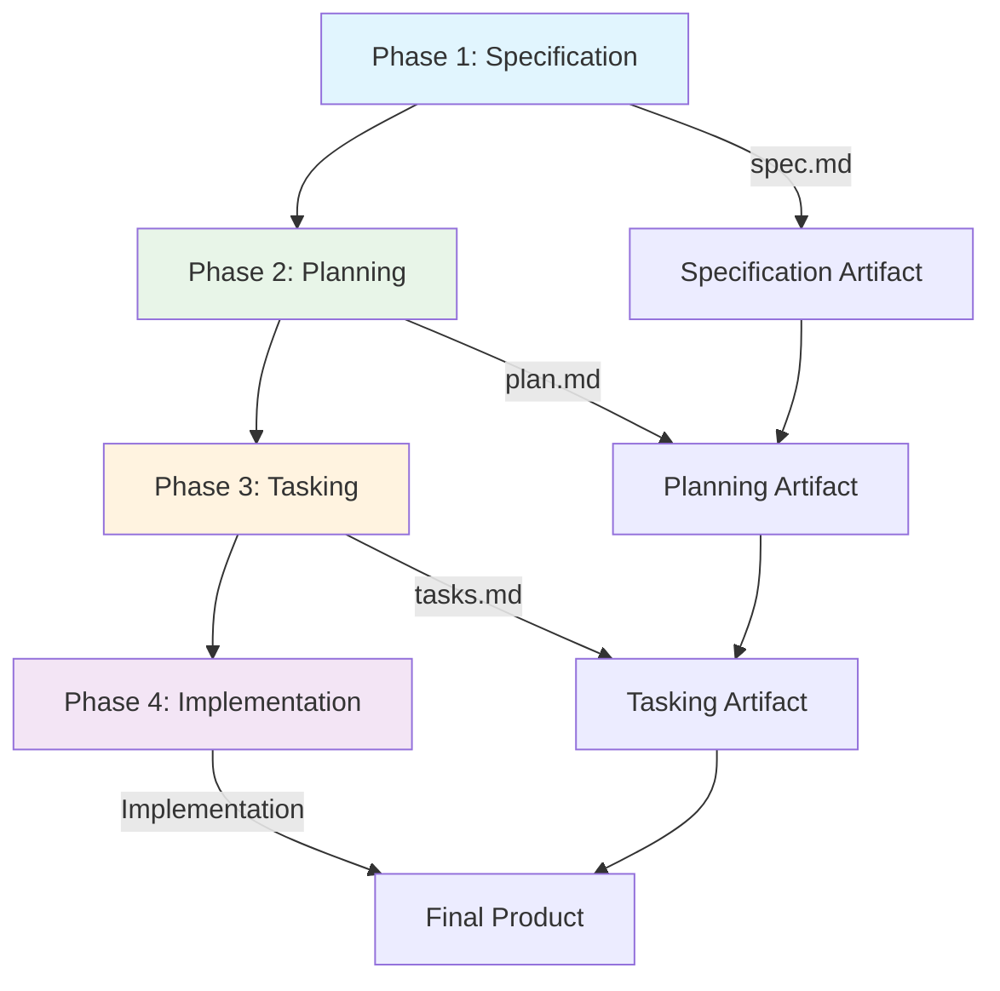
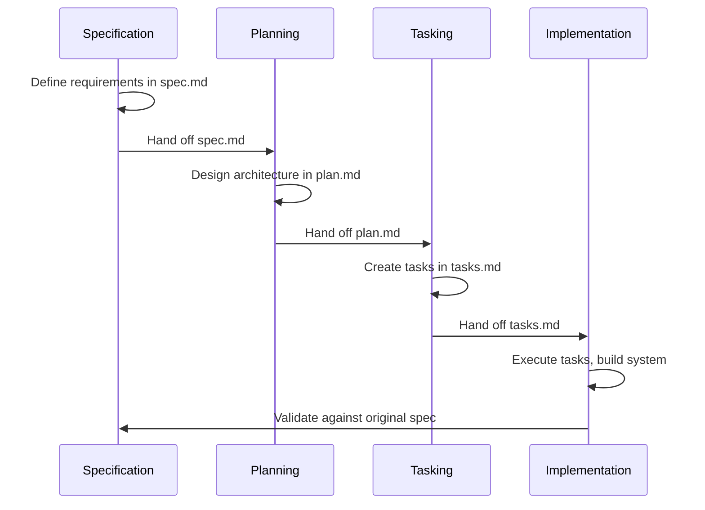
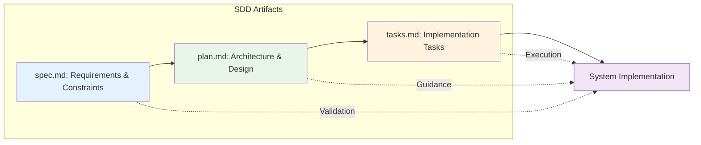

# Chapter 0.2: The New Workflow - Spec-Driven Physical AI (2025)

## Learning Objectives

After completing this chapter, you will be able to:

- Define Spec-Driven Development (SDD) in the context of Physical AI projects
- Explain the four phases of the SDD workflow and their purposes
- Identify when to use SDD methodology versus when it might be overkill
- Recognize common mistakes made when implementing SDD for robotics projects
- Apply SDD principles to structure your own Physical AI project

## Why This Matters in 2025

In 2025, the Physical AI revolution is accelerating at an unprecedented pace. Major companies like Figure AI, Tesla, Boston Dynamics, and Agility Robotics are shipping thousands of humanoid robots with increasingly sophisticated capabilities. But here's the challenge: as these systems become more complex, traditional development approaches are failing more often and at greater cost.

Spec-Driven Development (SDD) has emerged as the critical methodology for building reliable Physical AI systems. Unlike traditional AI that operates in virtual environments, Physical AI must interact safely and effectively with the real world. A software bug in a language model might generate an incorrect response; a bug in a humanoid robot could cause physical damage or injury. SDD provides the structure to catch these issues before deployment, saving both time and resources while ensuring safety.

## Spec-Driven Development — Plain English First

### Simple Definition
Spec-Driven Development (SDD) is a methodology where you define exactly what your system should do, how it should behave, and what constraints it must satisfy **before** you start writing any code.

### Precise Technical Explanation
SDD is a software engineering approach that emphasizes creating detailed specifications (specs) as the primary source of truth for system behavior, interfaces, and requirements. These specifications serve as contracts that guide implementation, testing, and validation. The methodology involves four distinct phases: Specification, Planning, Tasking, and Implementation, each building upon the previous to ensure alignment between intent and execution.

### Real-World Analogy
Think of SDD like creating detailed architectural blueprints before building a house. Just as architects and engineers create precise plans showing every wall, electrical outlet, and structural element before construction begins, SDD creates detailed "blueprints" for software systems that define exactly how they should behave before any code is written. This prevents costly changes and structural problems later in the project.

## SDD Workflow: Four Critical Phases

The Spec-Driven Development methodology follows four distinct phases, each with specific purposes and deliverables that build upon one another:

### Phase 1: Specification (Spec)
**Purpose**: Define what the system should do and establish success criteria.
**Key Activities**: Requirements gathering, constraint identification, acceptance criteria definition.
**Output**: spec.md file containing detailed requirements, user stories, and acceptance tests.
**Validation**: Stakeholders agree on what success looks like before implementation begins.

### Phase 2: Planning (Plan)
**Purpose**: Design the technical approach and architecture based on the specification.
**Key Activities**: Technology selection, system architecture design, interface definitions, data modeling.
**Output**: plan.md file containing architectural decisions, technical approach, and implementation strategy.
**Validation**: Technical feasibility confirmed and implementation approach validated.

### Phase 3: Tasking (Tasks)
**Purpose**: Break down the implementation into specific, testable tasks.
**Key Activities**: Task decomposition, test case creation, dependency mapping, prioritization.
**Output**: tasks.md file containing granular, executable tasks with clear acceptance criteria.
**Validation**: Tasks are specific enough that implementation can proceed systematically.

### Phase 4: Implementation (Implement)
**Purpose**: Execute the tasks while maintaining alignment with the original specification.
**Key Activities**: Code development, testing, integration, validation against spec.
**Output**: Working software that meets all original requirements.
**Validation**: System behaves exactly as specified in Phase 1, with proper testing throughout.

This systematic approach ensures that your Physical AI system does exactly what you intended, with clear traceability from initial requirements through final implementation.

## SDD Workflow Diagram

The following diagram illustrates the flow of the Spec-Driven Development methodology:



This flowchart shows how each phase builds upon the previous one, with clear artifacts produced at each stage that guide the next phase of development.

## Phase Transition Process

The following diagram shows how information flows between phases and how each phase transitions to the next:



This sequence diagram illustrates the handoff process between phases, ensuring that each phase receives the necessary information from the previous phase to proceed effectively.

## Artifact Relationships

The following diagram shows how the key artifacts in SDD relate to each other and support the development process:



This diagram shows how each artifact serves a specific purpose in the development process and how they work together to ensure successful implementation of your Physical AI system.

## Concrete Examples: Real SDD Artifacts

Let's look at actual examples from this book's development to see how SDD works in practice. Here are excerpts from the real spec.md, plan.md, and tasks.md files used to create this content:

### Example from spec.md (Specification)
```markdown
# Specification: Part 0 Content - Introduction to Physical AI and Humanoid Robotics

## User Story 1: Understanding Physical AI Significance
As a beginner AI practitioner, I want to understand why Physical AI is the next frontier, so that I can position myself strategically in this emerging field.

### Acceptance Criteria
- Reader with basic AI knowledge can articulate Physical AI definition
- Reader can identify 3+ opportunity domains for Physical AI
- Reader can explain 3+ unique challenges vs traditional AI
- Content is 4000 words with 2+ diagrams
```

### Example from plan.md (Planning)
```markdown
# Implementation Plan: Part 0 Content - Introduction to Physical AI and Humanoid Robotics

## Technical Context
Language/Version: MDX (Markdown + JSX), Docusaurus 3.9.2
Primary Dependencies: Docusaurus 3.9.2, Mermaid, React
Storage: Static MDX files in docs/part0-introduction/
Testing: Build validation, word count, language checks

## Project Structure
docs/part0-introduction/
├── part0-introduction.mdx                                # Overview (2k)
├── chapter-1-why-physical-ai-is-the-next-frontier.mdx  # Ch 0.1 (4k)
└── chapter-2-the-new-workflow-spec-driven-physical-ai.mdx # Ch 0.2 (4k)
```

### Example from tasks.md (Tasking)
```markdown
# Tasks: Part 0 Content - Introduction to Physical AI and Humanoid Robotics

## Phase 3: User Story 1 - Understanding Physical AI Significance (P1)

### Implementation Tasks
- [ ] T005 [US1] Invoke professional-author skill per Rule 15
- [ ] T006 [US1] Create chapter-1-why-physical-ai-is-the-next-frontier.mdx with valid YAML frontmatter
- [ ] T007 [US1] Write Learning Objectives section (3-5 actionable objectives)
- [ ] T008 [US1] Write Why This Matters in 2025 section using research.md
- [ ] T009 [US1] Write Physical AI definition in plain English (simple then technical)
- [ ] T010 [US1] Write 2025 landscape section (Figure AI, Tesla Optimus, Boston Dynamics, Agility with URLs)
```

These aren't abstract templates—they're the actual artifacts that guided the creation of this textbook. Notice how the spec defines *what* we want, the plan defines *how* we'll build it, and the tasks break down *what exactly* needs to be done. This is SDD in action, creating the content you're reading right now.

## SDD Benefits for Physical AI

Spec-Driven Development offers specific advantages when building Physical AI systems. Here are four key benefits that directly impact your success as a Physical AI developer:

### 1. Prevents Integration Failures
Physical AI systems require tight coordination between hardware and software components. SDD specifications define precise interfaces and constraints upfront, preventing costly hardware-software mismatches. For example, when developing a robot arm controller, SDD ensures that the software expects the exact torque ranges and response times that the physical actuators can deliver. According to research, model-driven approaches like SDD reduce integration time by 11% compared to code-centric approaches.

In practical terms, consider a scenario where you're building a warehouse robot that needs to pick up objects. Without SDD, you might write software that assumes the gripper can handle objects up to 10kg, but the actual hardware can only manage 5kg. This mismatch would be discovered only during expensive physical testing. With SDD, the specification phase would clearly define the gripper's capabilities, and all subsequent planning and implementation would align with those constraints.

The prevention of integration failures is particularly crucial in Physical AI because physical systems often involve expensive components that can be damaged by incorrect control signals. A servo motor receiving commands outside its operational range can be permanently damaged, whereas a software component can simply be recompiled with different parameters.

### 2. Reduces Expensive Debugging Cycles
Physical systems are expensive to test—each iteration might require building hardware, configuring environments, or risking equipment damage. SDD provides clear validation criteria that catch errors before physical deployment. This means you identify and fix logic errors in simulation or controlled environments rather than after deploying to expensive hardware.

Traditional debugging approaches for physical systems often involve a "build and break" cycle where developers repeatedly construct physical prototypes, test them, identify problems, and rebuild. This approach is not only time-consuming but also extremely costly when working with sophisticated hardware. With SDD, you can validate your system design against specifications using simulation tools, model checking, and formal verification before committing to hardware implementation.

For example, when developing a walking algorithm for a humanoid robot, SDD allows you to specify the exact gait parameters, balance constraints, and safety limits in your specification. You can then validate that your control algorithms meet these specifications in simulation before testing on actual hardware, potentially saving thousands of dollars in repairs and months of development time.

### 3. Enables AI-Assisted Development
SDD specifications serve as clear prompts for AI code generation tools. When you have well-defined requirements in your spec.md file, AI can generate ROS packages, control algorithms, and integration code much more effectively than when working from vague requirements. This accelerates your development timeline significantly.

Modern AI development tools, including GitHub Copilot, ChatGPT, and specialized robotics AI assistants, work best when given clear, structured requirements. A specification document that precisely defines interfaces, data formats, and behavioral requirements provides an ideal prompt for AI code generation. Instead of asking an AI to "write a robot controller," you can provide it with a detailed specification that says "write a ROS 2 action server that accepts PoseStamped goals and commands a differential drive robot to reach the target position with 0.1m accuracy."

Furthermore, SDD specifications can be used to automatically generate boilerplate code, configuration files, and even basic test cases. This automation becomes increasingly valuable as your Physical AI systems grow in complexity and require more integration between components.

### 4. Improves Cross-Disciplinary Team Alignment
Physical AI projects involve mechanical engineers, electrical engineers, software developers, and AI specialists—each with different expertise and terminology. SDD provides a single source of truth that all team members can reference, reducing miscommunication and ensuring everyone understands the system requirements. This is especially critical when team members have different technical backgrounds.

In a typical Physical AI project, the mechanical engineer might design a robotic arm without fully understanding the computational requirements of the vision system that will be mounted on it. The electrical engineer might select motors without considering the power consumption implications for the autonomy algorithms. The software team might develop control systems without accounting for the mechanical limitations of the joints. SDD specifications bridge these gaps by creating a shared understanding of system requirements that transcends individual discipline boundaries.

The specification document serves as a contract that all team members can reference when making decisions. When the mechanical engineer selects materials for a component, they can check the specification to see if it meets the weight and durability requirements. When the software team implements a control algorithm, they can verify it against the performance requirements specified in the document.

These benefits become increasingly important as Physical AI systems grow in complexity and involve more stakeholders. The systematic approach of SDD ensures that all team members are working toward the same goals and that the final system meets the intended requirements.

## When to Use SDD vs. When It's Overkill

While SDD offers significant advantages, it's not always the right approach for every project. Understanding when to apply SDD methodology will make you a more effective Physical AI developer:

### Use SDD When:
- **Multi-team projects**: When mechanical, electrical, and software teams need to coordinate. Physical AI projects typically involve specialists from multiple disciplines who need a common reference point to ensure their work aligns properly.
- **Complex systems**: Physical AI systems with multiple interacting components. If your robot has perception, planning, control, and communication subsystems that need to work together, SDD helps ensure these components integrate smoothly.
- **Hardware integration**: Projects requiring precise hardware-software coordination. When your software needs to work within specific hardware constraints like power limits, actuator ranges, or sensor capabilities, SDD helps capture these constraints upfront.
- **Safety-critical applications**: Systems where failure could cause damage or injury. In applications like medical robots, autonomous vehicles, or industrial automation, the cost of failure is high, making the upfront investment in SDD worthwhile.
- **Long-term projects**: Applications that will evolve over months or years. If you're building a platform that will be extended and maintained over time, SDD provides the documentation and structure needed for sustainable development.
- **AI-assisted development**: When you plan to use AI tools for code generation. As mentioned earlier, AI tools work best with well-defined specifications that clearly describe requirements and constraints.
- **Regulated environments**: Projects requiring documentation for compliance. Many industries have regulatory requirements that mandate documentation of design decisions and validation procedures, which SDD naturally provides.

### SDD Is Overkill When:
- **Quick prototypes**: Simple proof-of-concept implementations. When you're exploring an idea or testing a hypothesis, the overhead of creating detailed specifications might slow down your experimentation.
- **Single developer projects**: When one person handles all aspects. If you're working alone and can keep all project details in your head, the coordination benefits of SDD may not justify the documentation overhead.
- **Simple scripts**: Small programs under 100 lines of code. For very small programs that perform a single function, the specification might be longer than the code itself.
- **Educational basics**: Learning fundamental concepts without complex integration. When you're learning basic principles like how a PID controller works, focusing on the concept is more important than perfect process.
- **Experimental research**: Early-stage research where requirements change rapidly. In cutting-edge research, requirements and approaches often evolve quickly, making detailed specifications obsolete before implementation.
- **Time-boxed hackathons**: Projects with very tight deadlines. When you have only a few days to build a working prototype, you might need to prioritize implementation speed over process rigor.

The key is matching the methodology to your project's complexity and constraints. For most Physical AI applications you'll encounter in professional settings, SDD provides significant value that justifies the upfront specification effort.

It's also worth noting that you can apply SDD principles selectively. You don't need to create comprehensive specifications for every small script, but you might use SDD for the critical components of your system. For example, you might create detailed specifications for your robot's safety systems while using more agile approaches for experimental perception algorithms.

The goal is to be thoughtful about your process choices and select the approach that best fits your specific situation. As you gain experience with Physical AI development, you'll develop intuition for when the benefits of SDD justify the investment in specification work.

## Common SDD Mistakes in Physical AI

Even experienced developers make mistakes when applying SDD to Physical AI projects. Here are the most common pitfalls and how to avoid them:

### 1. Skipping the Specification Phase
**The Mistake**: Jumping directly to code without properly defining requirements.
**What You'll See**: Constant feature changes, integration problems, and systems that don't meet user needs.
**One-Line Fix**: Always write your spec.md first, even if it's just a basic outline.

This mistake is particularly dangerous in Physical AI because the cost of changing hardware is much higher than changing software. If you discover during implementation that your robot needs to lift heavier objects than originally planned, you might need to completely redesign mechanical components, not just modify software parameters.

### 2. Over-Planning Without Implementation
**The Mistake**: Spending months on detailed plans without building anything.
**What You'll See**: Plans that become obsolete as requirements change or technology evolves.
**One-Line Fix**: Plan just enough to start implementation, then iterate based on feedback.

The Physical AI field is rapidly evolving, with new hardware, algorithms, and tools emerging frequently. Over-planning can result in detailed plans that become obsolete before implementation begins. The key is to plan just enough to establish direction while maintaining flexibility to adapt as you learn more through implementation.

### 3. Writing Vague Requirements
**The Mistake**: Using ambiguous language like "the robot should work well" instead of specific, measurable criteria.
**What You'll See**: Different team members building different interpretations of the same requirement.
**One-Line Fix**: Always define success in measurable terms: "the robot should lift 5kg objects with 99% success rate."

In Physical AI, vague requirements can lead to dangerous situations. For example, saying "the robot should move safely" is too ambiguous. A better specification would be: "the robot should stop within 0.5 seconds when an obstacle is detected within 1 meter, and should never move faster than 0.5 m/s in human-populated areas."

### 4. Not Updating Specifications
**The Mistake**: Treating the spec as a one-time document instead of a living artifact.
**What You'll See**: Code that implements outdated requirements, causing misalignment between intent and implementation.
**One-Line Fix**: Update your spec.md whenever requirements change, and document the rationale.

Specifications should evolve as you learn more about your problem domain and constraints. However, it's crucial to maintain traceability between changes and their justifications. When you modify a specification, document why the change was necessary and how it affects other parts of the system.

### 5. Ignoring Hardware Constraints
**The Mistake**: Creating specifications that don't account for physical limitations of your robot or environment.
**What You'll See**: Software that works in simulation but fails when deployed to actual hardware.
**One-Line Fix**: Include hardware specifications, environmental constraints, and safety limits in your initial spec.

Physical AI systems must operate within real-world constraints like power limitations, processing capacity, weight restrictions, and environmental conditions. A specification that doesn't account for these constraints will result in systems that work in controlled environments but fail in real-world deployment.

### 6. Inadequate Cross-Phase Validation
**The Mistake**: Not validating that your implementation matches your original specification.
**What You'll See**: Systems that work differently than intended, requiring expensive rework.
**One-Line Fix**: Regularly compare your implementation against the original spec throughout development.

Validation should happen continuously, not just at the end of the project. Regular check-ins ensure that implementation stays aligned with specifications and that any necessary changes to specifications are documented and justified.

### 7. Insufficient Safety Considerations
**The Mistake**: Failing to specify safety requirements and failure modes in the initial specification.
**What You'll See**: Systems that work under normal conditions but fail dangerously when unexpected situations arise.
**One-Line Fix**: Include safety requirements, error handling, and failure mode specifications from the beginning.

Safety is paramount in Physical AI systems that interact with humans or operate in human environments. Specifications should explicitly define safe operating conditions, emergency procedures, and failure modes to ensure that systems degrade gracefully when problems occur.

### 8. Neglecting Performance Requirements
**The Mistake**: Focusing only on functional requirements while ignoring performance constraints.
**What You'll See**: Systems that perform the right actions but too slowly for practical use.
**One-Line Fix**: Include timing, throughput, and resource utilization requirements in your specifications.

Physical AI systems often have real-time requirements. A robot that takes 10 seconds to recognize an obstacle is useless for navigation at walking speed. Performance requirements must be specified alongside functional requirements to ensure systems are practically useful.

Avoiding these mistakes will help you successfully apply SDD to your Physical AI projects and achieve better outcomes with less rework.

## What's Next?

Great job completing this chapter on Spec-Driven Development! You now understand how to structure your Physical AI projects for success by defining clear specifications before implementation. You've learned the four phases of SDD, when to apply this methodology, and how to avoid common pitfalls.

In the next part of this book, you'll dive deep into **ROS 2 (Robot Operating System 2)**, the standard framework for building robot software. You'll learn how to apply the SDD principles you just mastered to create robust, maintainable robot applications. We'll start with the basics of ROS 2 architecture and work up to building complete robot behaviors using the same systematic approach you've learned here.

## Summary and Key Takeaways

As you conclude this chapter, let's review the key concepts you've mastered:

1. **SDD Definition**: Spec-Driven Development is a methodology where you define exactly what your system should do, how it should behave, and what constraints it must satisfy before writing any code. This approach is particularly valuable in Physical AI where hardware-software integration is critical.

2. **Four Phases**: You now understand the four phases of SDD - Specification, Planning, Tasking, and Implementation - and how each builds upon the previous one to ensure alignment between intent and execution.

3. **When to Apply**: You can identify when SDD provides value (complex multi-team projects, safety-critical applications) versus when it might be overkill (quick prototypes, single-developer projects).

4. **Common Mistakes**: You're now aware of the eight most common SDD mistakes in Physical AI and how to avoid them, particularly the critical importance of including hardware constraints and safety requirements in your specifications.

5. **Practical Application**: Through concrete examples from this book's own development, you've seen how SDD works in practice with real spec.md, plan.md, and tasks.md files.

These skills will serve you well as you advance in Physical AI development. The systematic approach you've learned will help you build more reliable, maintainable, and safe physical AI systems throughout your career.

You're building a solid foundation for becoming a Physical AI engineer—keep up the excellent work!
