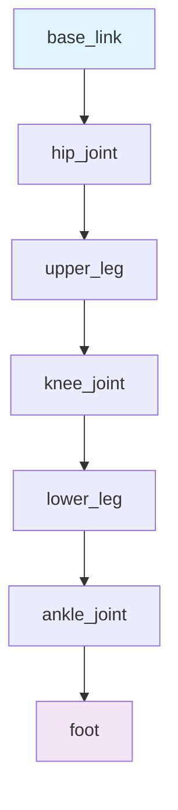
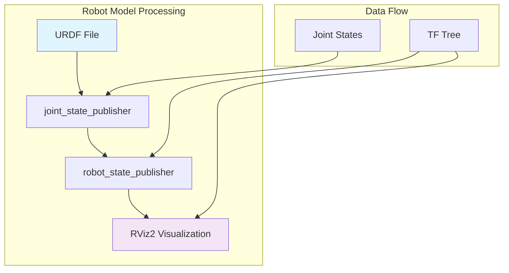

# Chapter 4: Talking to Robots

Welcome to the world of robot visualization! In this chapter, you'll learn how to describe robots using URDF (Unified Robot Description Format) and Xacro (XML Macros), and visualize them in RViz2, the 3D visualization tool for ROS 2. You'll create your first virtual robot, see it come to life in 3D, and understand how robots "see" themselves through their sensors. By the end of this chapter, you'll have built and visualized a simple humanoid robot model that can be used in simulation.

## Learning Objectives

After completing this chapter, you will be able to:
- Create robot models using URDF and Xacro for humanoid robots
- Visualize robot models in RViz2 with proper joint states and transformations
- Understand the TF (Transforms) tree and how robots track their body parts
- Use joint_state_publisher and robot_state_publisher to animate robot models
- Debug common URDF and visualization issues

## Why This Matters in 2025

Visualization is the bridge between abstract robot descriptions and tangible understanding. When building AI agents that interact with robots, you need to see what the robot sees and understand how it perceives its own body in space. URDF models and RViz2 visualization give you this crucial insight, allowing you to debug robot behavior, verify sensor data, and ensure your AI decisions make sense in the physical world. In 2025, with the rise of humanoid robots and embodied AI, understanding robot visualization is essential for creating systems that can operate safely and effectively in real environments.

## URDF/Xacro Definition in Plain English

### URDF (Unified Robot Description Format)

**In Plain English:** URDF is like a blueprint for robots — it describes every physical part of a robot, where those parts are located relative to each other, and how they can move. Think of it as a digital skeleton that defines how a robot's body is constructed.

**Technically:** URDF is an XML-based format that describes robot models including kinematic chains, visual and collision properties, inertial properties, and joint constraints. It defines the physical structure of a robot for simulation and visualization.

### Xacro (XML Macros)

**In Plain English:** Xacro is like a smart assistant for writing URDF files. Instead of writing the same information over and over (like for each finger on a robot hand), you can create templates and reuse them, making your robot descriptions much shorter and easier to maintain.

**Technically:** Xacro is an XML macro language that extends URDF with features like constants, expressions, and macros, allowing for more concise and maintainable robot descriptions.

## URDF/Xacro Examples: Simple Arm/leg Models for Humanoid Robots

Let's start with a simple humanoid leg model to understand the basic concepts:

### Basic Leg Link Definition

```xml
<!-- File: simple_leg.urdf.xacro -->
<?xml version="1.0"?>
<robot xmlns:xacro="http://www.ros.org/wiki/xacro" name="simple_leg">

  <!-- Define constants for our leg dimensions -->
  <xacro:property name="leg_length" value="0.5" />
  <xacro:property name="leg_radius" value="0.05" />
  <xacro:property name="hip_offset" value="0.1" />

  <!-- Base link - this is where the leg attaches to the body -->
  <link name="leg_base">
    <visual>
      <geometry>
        <box size="0.1 0.1 0.1"/>
      </geometry>
      <material name="blue">
        <color rgba="0 0 1 1"/>
      </material>
    </visual>
  </link>

  <!-- Hip joint - connects to upper leg -->
  <joint name="hip_joint" type="revolute">
    <parent link="leg_base"/>
    <child link="upper_leg"/>
    <origin xyz="0 0 -${hip_offset}" rpy="0 0 0"/>
    <axis xyz="0 1 0"/>
    <limit lower="-1.57" upper="1.57" effort="100" velocity="1"/>
  </joint>

  <!-- Upper leg link -->
  <link name="upper_leg">
    <visual>
      <geometry>
        <cylinder length="${leg_length}" radius="${leg_radius}"/>
      </geometry>
      <origin xyz="0 0 ${-leg_length/2}" rpy="1.57 0 0"/>
      <material name="gray">
        <color rgba="0.5 0.5 0.5 1"/>
      </material>
    </visual>
    <collision>
      <geometry>
        <cylinder length="${leg_length}" radius="${leg_radius}"/>
      </geometry>
      <origin xyz="0 0 ${-leg_length/2}" rpy="1.57 0 0"/>
    </collision>
    <inertial>
      <mass value="1.0"/>
      <inertia ixx="0.1" ixy="0.0" ixz="0.0" iyy="0.1" iyz="0.0" izz="0.1"/>
    </inertial>
  </link>

  <!-- Knee joint - connects upper to lower leg -->
  <joint name="knee_joint" type="revolute">
    <parent link="upper_leg"/>
    <child link="lower_leg"/>
    <origin xyz="0 0 ${-leg_length}" rpy="0 0 0"/>
    <axis xyz="0 1 0"/>
    <limit lower="0" upper="2.35" effort="100" velocity="1"/>
  </joint>

  <!-- Lower leg link -->
  <link name="lower_leg">
    <visual>
      <geometry>
        <cylinder length="${leg_length}" radius="${leg_radius}"/>
      </geometry>
      <origin xyz="0 0 ${-leg_length/2}" rpy="1.57 0 0"/>
      <material name="gray">
        <color rgba="0.5 0.5 0.5 1"/>
      </material>
    </visual>
    <collision>
      <geometry>
        <cylinder length="${leg_length}" radius="${leg_radius}"/>
      </geometry>
      <origin xyz="0 0 ${-leg_length/2}" rpy="1.57 0 0"/>
    </collision>
    <inertial>
      <mass value="0.8"/>
      <inertia ixx="0.08" ixy="0.0" ixz="0.0" iyy="0.08" iyz="0.0" izz="0.08"/>
    </inertial>
  </link>

  <!-- Ankle joint - connects to foot -->
  <joint name="ankle_joint" type="revolute">
    <parent link="lower_leg"/>
    <child link="foot"/>
    <origin xyz="0 0 ${-leg_length}" rpy="0 0 0"/>
    <axis xyz="0 1 0"/>
    <limit lower="-0.78" upper="0.78" effort="100" velocity="1"/>
  </joint>

  <!-- Foot link -->
  <link name="foot">
    <visual>
      <geometry>
        <box size="0.2 0.1 0.05"/>
      </geometry>
      <material name="black">
        <color rgba="0.1 0.1 0.1 1"/>
      </material>
    </visual>
    <collision>
      <geometry>
        <box size="0.2 0.1 0.05"/>
      </geometry>
    </collision>
    <inertial>
      <mass value="0.5"/>
      <inertia ixx="0.01" ixy="0.0" ixz="0.0" iyy="0.01" iyz="0.0" izz="0.01"/>
    </inertial>
  </link>

</robot>
```

### Xacro Macros for Reusability

Now let's create a more sophisticated version using Xacro macros to make our robot descriptions more maintainable:

```xml
<!-- File: humanoid_macros.xacro -->
<?xml version="1.0"?>
<robot xmlns:xacro="http://www.ros.org/wiki/xacro">

  <!-- Macro for a simple joint -->
  <xacro:macro name="simple_joint" params="name type parent child origin_xyz axis_xyz lower upper">
    <joint name="${name}" type="${type}">
      <parent link="${parent}"/>
      <child link="${child}"/>
      <origin xyz="${origin_xyz}" rpy="0 0 0"/>
      <axis xyz="${axis_xyz}"/>
      <limit lower="${lower}" upper="${upper}" effort="100" velocity="1"/>
    </joint>
  </xacro:macro>

  <!-- Macro for a simple link with cylinder geometry -->
  <xacro:macro name="cylinder_link" params="name length radius color_xyz origin_rpy">
    <link name="${name}">
      <visual>
        <geometry>
          <cylinder length="${length}" radius="${radius}"/>
        </geometry>
        <origin xyz="0 0 ${-length/2}" rpy="${origin_rpy}"/>
        <material name="material_${name}">
          <color rgba="${color_xyz} 1"/>
        </material>
      </visual>
      <collision>
        <geometry>
          <cylinder length="${length}" radius="${radius}"/>
        </geometry>
        <origin xyz="0 0 ${-length/2}" rpy="${origin_rpy}"/>
      </collision>
      <inertial>
        <mass value="0.1"/>
        <inertia ixx="0.01" ixy="0.0" ixz="0.0" iyy="0.01" iyz="0.0" izz="0.01"/>
      </inertial>
    </link>
  </xacro:macro>

</robot>
```

## Mermaid Diagram: URDF Kinematic Chain



This diagram shows a simple kinematic chain from the base of the robot to the foot. Each joint connects to the next link in the chain, creating a tree-like structure that defines how parts of the robot move relative to each other.

## Mermaid Diagram: Robot Model Hierarchy



This diagram illustrates the flow from a URDF description through the ROS 2 system to visualization in RViz2. The joint_state_publisher and robot_state_publisher nodes work together to transform the static URDF description into a dynamic, animated robot model.

## Joint State Publisher and Robot State Publisher

### Joint State Publisher

The joint_state_publisher node is responsible for publishing joint states for joints that don't have actual controllers. For example, if you have a robot with fixed joints or continuous joints that you want to move manually for visualization purposes, the joint_state_publisher provides those values.

```bash
# Launch joint state publisher for a robot
ros2 run joint_state_publisher joint_state_publisher
```

You can also configure it with parameters:
```xml
<!-- In a launch file -->
<node pkg="joint_state_publisher" exec="joint_state_publisher" name="joint_state_publisher">
  <param name="use_gui" value="true"/>
  <param name="rate" value="50"/>
</node>
```

### Robot State Publisher

The robot_state_publisher node takes the static URDF model and the dynamic joint states, then calculates and publishes the transformations (TF) between all the links in your robot. This is what allows RViz2 to properly visualize your robot in 3D space.

```bash
# Launch robot state publisher with URDF file
ros2 run robot_state_publisher robot_state_publisher --ros-args -p robot_description:='$(find-pkg-share my_robot_description)/urdf/my_robot.urdf'
```

## RViz2 Visualization: Joint States and TF Frames

RViz2 (Robot Visualizer 2) is the primary 3D visualization tool for ROS 2. It displays robot models, sensor data, paths, and other visual elements that help you understand what your robot is doing.

### Setting Up RViz2 for Robot Visualization

1. **Launch RViz2**:
```bash
ros2 run rviz2 rviz2
```

2. **Add the RobotModel display**:
   - Click "Add" in the Displays panel
   - Select "RobotModel" under "Robot Models"
   - Set the "Robot Description" parameter to your URDF parameter name (usually "robot_description")

3. **Add TF display** (to see transformations):
   - Click "Add" in the Displays panel
   - Select "TF" under "TF"
   - This shows the coordinate frames and how they relate to each other

### TF (Transforms) Tree

The TF tree is a critical concept in robotics. It represents how all the coordinate frames in your robot system relate to each other. Each link in your URDF has its own coordinate frame, and the TF tree shows how these frames are positioned and oriented relative to each other.

For example, in a humanoid robot:
- base_link is the root frame
- torso_frame is connected to base_link
- head_frame, left_arm_frame, right_arm_frame, left_leg_frame, right_leg_frame are all connected to torso_frame
- Each arm and leg continues with its own chain of joints and links

## Hands-On Example: Creating and Visualizing a Simple Humanoid Model

Let's create a complete simple humanoid model and visualize it:

### Complete Humanoid URDF

```xml
<!-- File: simple_humanoid.urdf.xacro -->
<?xml version="1.0"?>
<robot xmlns:xacro="http://www.ros.org/wiki/xacro" name="simple_humanoid">

  <!-- Include our macros -->
  <xacro:include filename="humanoid_macros.xacro" />

  <!-- Define properties -->
  <xacro:property name="PI" value="3.1415926535897931" />
  <xacro:property name="body_length" value="0.5" />
  <xacro:property name="body_width" value="0.3" />
  <xacro:property name="body_height" value="0.2" />
  <xacro:property name="arm_length" value="0.4" />
  <xacro:property name="arm_radius" value="0.05" />
  <xacro:property name="leg_length" value="0.6" />
  <xacro:property name="leg_radius" value="0.06" />
  <xacro:property name="head_radius" value="0.15" />

  <!-- Base/Root link -->
  <link name="base_link">
    <visual>
      <geometry>
        <box size="${body_length} ${body_width} ${body_height}"/>
      </geometry>
      <material name="white">
        <color rgba="1 1 1 1"/>
      </material>
    </visual>
    <collision>
      <geometry>
        <box size="${body_length} ${body_width} ${body_height}"/>
      </geometry>
    </collision>
    <inertial>
      <mass value="10.0"/>
      <inertia ixx="1.0" ixy="0.0" ixz="0.0" iyy="1.0" iyz="0.0" izz="1.0"/>
    </inertial>
  </link>

  <!-- Head -->
  <joint name="head_joint" type="revolute">
    <parent link="base_link"/>
    <child link="head"/>
    <origin xyz="${body_length/2} 0 ${body_height/2}" rpy="0 0 0"/>
    <axis xyz="0 1 0"/>
    <limit lower="${-PI/4}" upper="${PI/4}" effort="100" velocity="1"/>
  </joint>

  <link name="head">
    <visual>
      <geometry>
        <sphere radius="${head_radius}"/>
      </geometry>
      <material name="skin">
        <color rgba="1 0.8 0.6 1"/>
      </material>
    </visual>
    <collision>
      <geometry>
        <sphere radius="${head_radius}"/>
      </geometry>
    </collision>
    <inertial>
      <mass value="2.0"/>
      <inertia ixx="0.02" ixy="0.0" ixz="0.0" iyy="0.02" iyz="0.0" izz="0.02"/>
    </inertial>
  </link>

  <!-- Left Arm -->
  <joint name="left_shoulder_joint" type="revolute">
    <parent link="base_link"/>
    <child link="left_upper_arm"/>
    <origin xyz="${body_length/4} ${body_width/2 + arm_radius} 0" rpy="0 0 0"/>
    <axis xyz="1 0 0"/>
    <limit lower="${-PI/2}" upper="${PI/2}" effort="100" velocity="1"/>
  </joint>

  <link name="left_upper_arm">
    <visual>
      <geometry>
        <cylinder length="${arm_length}" radius="${arm_radius}"/>
      </geometry>
      <origin xyz="0 0 ${-arm_length/2}" rpy="${PI/2} 0 0"/>
      <material name="gray">
        <color rgba="0.5 0.5 0.5 1"/>
      </material>
    </visual>
    <collision>
      <geometry>
        <cylinder length="${arm_length}" radius="${arm_radius}"/>
      </geometry>
      <origin xyz="0 0 ${-arm_length/2}" rpy="${PI/2} 0 0"/>
    </collision>
    <inertial>
      <mass value="1.0"/>
      <inertia ixx="0.01" ixy="0.0" ixz="0.0" iyy="0.01" iyz="0.0" izz="0.01"/>
    </inertial>
  </link>

  <joint name="left_elbow_joint" type="revolute">
    <parent link="left_upper_arm"/>
    <child link="left_lower_arm"/>
    <origin xyz="0 0 ${-arm_length}" rpy="0 0 0"/>
    <axis xyz="1 0 0"/>
    <limit lower="0" upper="${PI/2}" effort="100" velocity="1"/>
  </joint>

  <link name="left_lower_arm">
    <visual>
      <geometry>
        <cylinder length="${arm_length}" radius="${arm_radius}"/>
      </geometry>
      <origin xyz="0 0 ${-arm_length/2}" rpy="${PI/2} 0 0"/>
      <material name="gray">
        <color rgba="0.5 0.5 0.5 1"/>
      </material>
    </visual>
    <collision>
      <geometry>
        <cylinder length="${arm_length}" radius="${arm_radius}"/>
      </geometry>
      <origin xyz="0 0 ${-arm_length/2}" rpy="${PI/2} 0 0"/>
    </collision>
    <inertial>
      <mass value="0.8"/>
      <inertia ixx="0.008" ixy="0.0" ixz="0.0" iyy="0.008" iyz="0.0" izz="0.008"/>
    </inertial>
  </link>

  <!-- Right Arm (mirror of left arm) -->
  <joint name="right_shoulder_joint" type="revolute">
    <parent link="base_link"/>
    <child link="right_upper_arm"/>
    <origin xyz="${body_length/4} ${-(body_width/2 + arm_radius)} 0" rpy="0 0 0"/>
    <axis xyz="1 0 0"/>
    <limit lower="${-PI/2}" upper="${PI/2}" effort="100" velocity="1"/>
  </joint>

  <link name="right_upper_arm">
    <visual>
      <geometry>
        <cylinder length="${arm_length}" radius="${arm_radius}"/>
      </geometry>
      <origin xyz="0 0 ${-arm_length/2}" rpy="${PI/2} 0 0"/>
      <material name="gray">
        <color rgba="0.5 0.5 0.5 1"/>
      </material>
    </visual>
    <collision>
      <geometry>
        <cylinder length="${arm_length}" radius="${arm_radius}"/>
      </geometry>
      <origin xyz="0 0 ${-arm_length/2}" rpy="${PI/2} 0 0"/>
    </collision>
    <inertial>
      <mass value="1.0"/>
      <inertia ixx="0.01" ixy="0.0" ixz="0.0" iyy="0.01" iyz="0.0" izz="0.01"/>
    </inertial>
  </link>

  <joint name="right_elbow_joint" type="revolute">
    <parent link="right_upper_arm"/>
    <child link="right_lower_arm"/>
    <origin xyz="0 0 ${-arm_length}" rpy="0 0 0"/>
    <axis xyz="1 0 0"/>
    <limit lower="0" upper="${PI/2}" effort="100" velocity="1"/>
  </joint>

  <link name="right_lower_arm">
    <visual>
      <geometry>
        <cylinder length="${arm_length}" radius="${arm_radius}"/>
      </geometry>
      <origin xyz="0 0 ${-arm_length/2}" rpy="${PI/2} 0 0"/>
      <material name="gray">
        <color rgba="0.5 0.5 0.5 1"/>
      </material>
    </visual>
    <collision>
      <geometry>
        <cylinder length="${arm_length}" radius="${arm_radius}"/>
      </geometry>
      <origin xyz="0 0 ${-arm_length/2}" rpy="${PI/2} 0 0"/>
    </collision>
    <inertial>
      <mass value="0.8"/>
      <inertia ixx="0.008" ixy="0.0" ixz="0.0" iyy="0.008" iyz="0.0" izz="0.008"/>
    </inertial>
  </link>

  <!-- Left Leg -->
  <joint name="left_hip_joint" type="revolute">
    <parent link="base_link"/>
    <child link="left_upper_leg"/>
    <origin xyz="${-body_length/3} ${body_width/3} ${-body_height/2}" rpy="0 0 0"/>
    <axis xyz="0 1 0"/>
    <limit lower="${-PI/2}" upper="${PI/2}" effort="100" velocity="1"/>
  </joint>

  <link name="left_upper_leg">
    <visual>
      <geometry>
        <cylinder length="${leg_length}" radius="${leg_radius}"/>
      </geometry>
      <origin xyz="0 0 ${-leg_length/2}" rpy="${PI/2} 0 0"/>
      <material name="blue">
        <color rgba="0 0 1 1"/>
      </material>
    </visual>
    <collision>
      <geometry>
        <cylinder length="${leg_length}" radius="${leg_radius}"/>
      </geometry>
      <origin xyz="0 0 ${-leg_length/2}" rpy="${PI/2} 0 0"/>
    </collision>
    <inertial>
      <mass value="2.0"/>
      <inertia ixx="0.02" ixy="0.0" ixz="0.0" iyy="0.02" iyz="0.0" izz="0.02"/>
    </inertial>
  </link>

  <joint name="left_knee_joint" type="revolute">
    <parent link="left_upper_leg"/>
    <child link="left_lower_leg"/>
    <origin xyz="0 0 ${-leg_length}" rpy="0 0 0"/>
    <axis xyz="0 1 0"/>
    <limit lower="0" upper="${PI/2}" effort="100" velocity="1"/>
  </joint>

  <link name="left_lower_leg">
    <visual>
      <geometry>
        <cylinder length="${leg_length}" radius="${leg_radius}"/>
      </geometry>
      <origin xyz="0 0 ${-leg_length/2}" rpy="${PI/2} 0 0"/>
      <material name="blue">
        <color rgba="0 0 1 1"/>
      </material>
    </visual>
    <collision>
      <geometry>
        <cylinder length="${leg_length}" radius="${leg_radius}"/>
      </geometry>
      <origin xyz="0 0 ${-leg_length/2}" rpy="${PI/2} 0 0"/>
    </collision>
    <inertial>
      <mass value="1.5"/>
      <inertia ixx="0.015" ixy="0.0" ixz="0.0" iyy="0.015" iyz="0.0" izz="0.015"/>
    </inertial>
  </link>

  <joint name="left_ankle_joint" type="revolute">
    <parent link="left_lower_leg"/>
    <child link="left_foot"/>
    <origin xyz="0 0 ${-leg_length}" rpy="0 0 0"/>
    <axis xyz="0 1 0"/>
    <limit lower="${-PI/6}" upper="${PI/6}" effort="100" velocity="1"/>
  </joint>

  <link name="left_foot">
    <visual>
      <geometry>
        <box size="0.2 0.1 0.05"/>
      </geometry>
      <material name="black">
        <color rgba="0.1 0.1 0.1 1"/>
      </material>
    </visual>
    <collision>
      <geometry>
        <box size="0.2 0.1 0.05"/>
      </geometry>
    </collision>
    <inertial>
      <mass value="0.5"/>
      <inertia ixx="0.001" ixy="0.0" ixz="0.0" iyy="0.001" iyz="0.0" izz="0.001"/>
    </inertial>
  </link>

  <!-- Right Leg (mirror of left leg) -->
  <joint name="right_hip_joint" type="revolute">
    <parent link="base_link"/>
    <child link="right_upper_leg"/>
    <origin xyz="${-body_length/3} ${-body_width/3} ${-body_height/2}" rpy="0 0 0"/>
    <axis xyz="0 1 0"/>
    <limit lower="${-PI/2}" upper="${PI/2}" effort="100" velocity="1"/>
  </joint>

  <link name="right_upper_leg">
    <visual>
      <geometry>
        <cylinder length="${leg_length}" radius="${leg_radius}"/>
      </geometry>
      <origin xyz="0 0 ${-leg_length/2}" rpy="${PI/2} 0 0"/>
      <material name="blue">
        <color rgba="0 0 1 1"/>
      </material>
    </visual>
    <collision>
      <geometry>
        <cylinder length="${leg_length}" radius="${leg_radius}"/>
      </geometry>
      <origin xyz="0 0 ${-leg_length/2}" rpy="${PI/2} 0 0"/>
    </collision>
    <inertial>
      <mass value="2.0"/>
      <inertia ixx="0.02" ixy="0.0" ixz="0.0" iyy="0.02" iyz="0.0" izz="0.02"/>
    </inertial>
  </link>

  <joint name="right_knee_joint" type="revolute">
    <parent link="right_upper_leg"/>
    <child link="right_lower_leg"/>
    <origin xyz="0 0 ${-leg_length}" rpy="0 0 0"/>
    <axis xyz="0 1 0"/>
    <limit lower="0" upper="${PI/2}" effort="100" velocity="1"/>
  </joint>

  <link name="right_lower_leg">
    <visual>
      <geometry>
        <cylinder length="${leg_length}" radius="${leg_radius}"/>
      </geometry>
      <origin xyz="0 0 ${-leg_length/2}" rpy="${PI/2} 0 0"/>
      <material name="blue">
        <color rgba="0 0 1 1"/>
      </material>
    </visual>
    <collision>
      <geometry>
        <cylinder length="${leg_length}" radius="${leg_radius}"/>
      </geometry>
      <origin xyz="0 0 ${-leg_length/2}" rpy="${PI/2} 0 0"/>
    </collision>
    <inertial>
      <mass value="1.5"/>
      <inertia ixx="0.015" ixy="0.0" ixz="0.0" iyy="0.015" iyz="0.0" izz="0.015"/>
    </inertial>
  </link>

  <joint name="right_ankle_joint" type="revolute">
    <parent link="right_lower_leg"/>
    <child link="right_foot"/>
    <origin xyz="0 0 ${-leg_length}" rpy="0 0 0"/>
    <axis xyz="0 1 0"/>
    <limit lower="${-PI/6}" upper="${PI/6}" effort="100" velocity="1"/>
  </joint>

  <link name="right_foot">
    <visual>
      <geometry>
        <box size="0.2 0.1 0.05"/>
      </geometry>
      <material name="black">
        <color rgba="0.1 0.1 0.1 1"/>
      </material>
    </visual>
    <collision>
      <geometry>
        <box size="0.2 0.1 0.05"/>
      </geometry>
    </collision>
    <inertial>
      <mass value="0.5"/>
      <inertia ixx="0.001" ixy="0.0" ixz="0.0" iyy="0.001" iyz="0.0" izz="0.001"/>
    </inertial>
  </link>

</robot>
```

### Launch File for Visualization

```xml
<!-- File: launch/robot_visualization.launch.py -->
from launch import LaunchDescription
from launch.actions import DeclareLaunchArgument
from launch.substitutions import Command, LaunchConfiguration
from launch_ros.actions import Node
from launch_ros.parameter_descriptions import ParameterValue
from ament_index_python.packages import get_package_share_directory
import os

def generate_launch_description():
    # Get the package share directory
    pkg_share = get_package_share_directory('my_robot_description')

    # Define the URDF file path
    default_model_path = os.path.join(pkg_share, 'urdf/simple_humanoid.urdf.xacro')

    # Declare launch arguments
    model_arg = DeclareLaunchArgument(
        name='model',
        default_value=default_model_path,
        description='Absolute path to robot urdf file'
    )

    robot_description = ParameterValue(
        Command(['xacro ', LaunchConfiguration('model')]),
        value_type=str
    )

    # Robot State Publisher node
    robot_state_publisher = Node(
        package='robot_state_publisher',
        executable='robot_state_publisher',
        parameters=[{'robot_description': robot_description}]
    )

    # Joint State Publisher node
    joint_state_publisher = Node(
        package='joint_state_publisher',
        executable='joint_state_publisher',
        parameters=[{'use_gui': True}]
    )

    # RViz2 node
    rviz2 = Node(
        package='rviz2',
        executable='rviz2',
        name='rviz2',
        arguments=['-d', os.path.join(pkg_share, 'rviz', 'robot_visualization.rviz')]
    )

    return LaunchDescription([
        model_arg,
        joint_state_publisher,
        robot_state_publisher,
        rviz2
    ])
```

### RViz2 Configuration File

```yaml
# File: rviz/robot_visualization.rviz
Panels:
  - Class: rviz_common/Displays
    Help Height: 78
    Name: Displays
    Property Tree Widget:
      Expanded:
        - /Global Options1
        - /Status1
        - /RobotModel1
        - /TF1
      Splitter Ratio: 0.5
    Tree Height: 617
  - Class: rviz_common/Selection
    Name: Selection
  - Class: rviz_common/Tool Properties
    Expanded:
      - /2D Goal Pose1
      - /Publish Point1
    Name: Tool Properties
    Splitter Ratio: 0.5886790156364441
Visualization Manager:
  Class: ""
  Displays:
    - Alpha: 0.5
      Cell Size: 1
      Class: rviz_default_plugins/Grid
      Color: 160; 160; 164
      Enabled: true
      Line Style:
        Line Width: 0.029999999329447746
        Value: Lines
      Name: Grid
      Normal Cell Count: 0
      Offset:
        X: 0
        Y: 0
        Z: 0
      Plane: XY
      Plane Cell Count: 10
      Reference Frame: <Fixed Frame>
      Value: true
    - Class: rviz_default_plugins/RobotModel
      Enabled: true
      Name: RobotModel
      Description Topic:
        Depth: 5
        Durability Policy: Volatile
        History Policy: Keep Last
        Reliability Policy: Reliable
      Description: robot_description
      TF Prefix: ""
      Update Interval: 0
      Value: true
      Visual Enabled: true
    - Class: rviz_default_plugins/TF
      Enabled: true
      Frame Timeout: 15
      Marker Scale: 1
      Name: TF
      Show Arrows: true
      Show Axes: true
      Show Names: false
      Tree:
        All Enabled: true
      Update Interval: 0
      Value: true
  Enabled: true
  Global Options:
    Background Color: 48; 48; 48
    Fixed Frame: base_link
    Frame Rate: 30
  Name: root
  Tools:
    - Class: rviz_default_plugins/Interact
      Hide Inactive Objects: true
    - Class: rviz_default_plugins/MoveCamera
    - Class: rviz_default_plugins/Select
    - Class: rviz_default_plugins/FocusCamera
    - Class: rviz_default_plugins/Measure
    - Class: rviz_default_plugins/SetInitialPose
    - Class: rviz_default_plugins/SetGoal
    - Class: rviz_default_plugins/PublishPoint
    - Class: rviz_default_plugins/Goal3D
    - Class: rviz_default_plugins/Point
  Transformation:
    Current:
      Class: rviz_default_plugins/TF
  Value: true
  Views:
    Current:
      Class: rviz_default_plugins/Orbit
      Distance: 3.0
      Enable Stereo Rendering:
        Stereo Eye Separation: 0.05999999865889549
        Stereo Focal Distance: 1
        Swap Stereo Eyes: false
        Value: false
      Focal Point:
        X: 0
        Y: 0
        Z: 0
      Focal Shape Fixed Size: true
      Focal Shape Size: 0.05000000074505806
      Invert Z Axis: false
      Name: Current View
      Near Clip Distance: 0.009999999776482582
      Pitch: 0.5
      Target Frame: <Fixed Frame>
      Value: Orbit (rviz)
      Yaw: 0.5
    Saved: ~
Window Geometry:
  Displays:
    collapsed: false
  Height: 846
  Hide Left Dock: false
  Hide Right Dock: true
  QMainWindow State: 000000ff00000000fd000000040000000000000156000002f4fc0200000008fb0000001200530065006c0065006300740069006f006e00000001e10000009b0000005c00fffffffb0000001e0054006f006f006c002000500072006f007000650072007400690065007300000000e3000001560000005c00fffffffb000000200054006f006f006c002000500072006f007000650072007400690065007300000000e3000001560000005c00fffffffb0000000a0049006d00610067006500000001d1000001600000000000000000fb000000100044006900730070006c006100790073010000003d000002f4000000c900fffffffb0000002000730065006c0065006300740069006f006e00200062007500660066006500720200000138000000a30000016e0000016e000000a3fb00000014005700690064006500530074006500720065006f0000000000000000e00000000000000000fb0000000c004b0069006e006500630074000000018600000106000002f40000010e000000010000010f000002f4fc0200000003fb0000001e0054006f006f006c002000500072006f00700065007200740069006500730100000041000000780000000000000000fb0000000a00560069006500770073000000003d000002f4000000a400fffffffb0000001200530065006c0065006300740069006f006e010000025a000000b200000000000000000000000200000490000000a9fc0100000001fb0000000a00560069006500770073030000004e00000080000002e10000019700000003000004420000003efc0100000002fb0000000800540069006d00650100000000000004420000000000000000fb0000000800540069006d00650100000000000004500000000000000000000003a3000002f400000004000000040000000800000008fc0000000100000002000000010000000a0054006f006f006c00730100000000ffffffff0000000000000000
  Width: 1200
  X: 72
  Y: 60
```

## Common Mistakes and How to Fix Them

### Malformed URDF Issues

**Mistake**: Missing closing tags or incorrect XML structure
- **What you'll see**: XML parsing errors when loading the URDF
- **One-line fix**: Validate your XML with a parser or check for matching opening/closing tags

**Mistake**: Incorrect joint connections
- **What you'll see**: Robot model doesn't display correctly or links float in space
- **One-line fix**: Ensure every joint has a valid parent and child link that exist in your URDF

**Mistake**: Units inconsistency
- **What you'll see**: Robot appears too large or too small
- **One-line fix**: Remember that URDF uses meters for all length measurements

### TF Tree Issues

**Mistake**: Disconnected TF tree
- **What you'll see**: Some parts of the robot don't show up or move properly
- **One-line fix**: Ensure all links are connected through joints back to a single root link

**Mistake**: Multiple root frames
- **What you'll see**: RViz2 can't properly display the robot
- **One-line fix**: Have only one link without a parent joint (this becomes your base_link)

**Mistake**: Cyclic dependencies in joints
- **What you'll see**: Robot state publisher crashes or TF errors
- **One-line fix**: Ensure your joint connections form a tree structure, not a graph with cycles

## Verify Success

Run this command to verify your URDF is valid:

```bash
# Check if your URDF file is syntactically correct
check_urdf $(ros2 pkg prefix my_robot_description)/share/my_robot_description/urdf/simple_humanoid.urdf.xacro
```

Or test the visualization:
```bash
# Launch your robot visualization
ros2 launch my_robot_description robot_visualization.launch.py
```

If you see your humanoid robot model in RViz2 with all parts properly connected and movable, you're ready for the next chapter!

## What's Next?

In Chapter 5, you'll learn how to create real ROS 2 packages with colcon, organize your code professionally, and manage complex systems with launch files and parameters. You'll take the visualization skills you've learned here and apply them to building production-ready robotic applications!

## Key Terms Defined

- **URDF**: Unified Robot Description Format, an XML-based format for describing robot models
- **Xacro**: XML macro language that extends URDF with features like constants and macros
- **TF (Transforms)**: The system that tracks coordinate frame relationships in ROS 2
- **Robot State Publisher**: Node that calculates and publishes transformations between robot links
- **Joint State Publisher**: Node that publishes joint state information for visualization
- **RViz2**: The 3D visualization tool for ROS 2
- **Collision Geometry**: The shape used for physics simulation and collision detection
- **Visual Geometry**: The shape used for visualization in RViz2
- **Inertial Properties**: Mass and moment of inertia values for physics simulation
- **Kinematic Chain**: A series of rigid bodies connected by joints

## Advanced URDF Concepts

### Materials and Textures

In addition to basic geometric shapes, URDF supports materials and textures to enhance visualization:

```xml
<material name="red">
  <color rgba="1 0 0 1"/>
</material>

<material name="blue">
  <color rgba="0 0 1 1"/>
</material>

<material name="green">
  <color rgba="0 1 0 1"/>
</material>

<!-- You can also define materials with textures -->
<material name="checkerboard">
  <color rgba="1 1 1 1"/>
  <texture filename="package://my_robot_description/meshes/checkerboard.png"/>
</material>
```

Materials are defined once and can be reused across multiple links in your robot model, making it easy to maintain consistent colors and appearances throughout your robot.

### Gazebo Integration

For simulation in Gazebo, you can add Gazebo-specific extensions to your URDF:

```xml
<gazebo reference="link_name">
  <material>Gazebo/Blue</material>
  <mu1>0.9</mu1>
  <mu2>0.9</mu2>
  <kp>1000000.0</kp>
  <kd>1.0</kd>
</gazebo>
```

These tags provide additional physics properties and visual materials specifically for the Gazebo simulation environment.

### Transmission Elements

For real robots with actuators, you need to define transmission elements that connect joints to actuators:

```xml
<transmission name="left_wheel_trans">
  <type>transmission_interface/SimpleTransmission</type>
  <joint name="left_wheel_joint">
    <hardwareInterface>hardware_interface/VelocityJointInterface</hardwareInterface>
  </joint>
  <actuator name="left_wheel_motor">
    <hardwareInterface>hardware_interface/VelocityJointInterface</hardwareInterface>
    <mechanicalReduction>1</mechanicalReduction>
  </actuator>
</transmission>
```

### Safety Controllers

URDF can also define safety limits for joints:

```xml
<safety_controller k_velocity="10" k_position="15" soft_lower_limit="-1.5" soft_upper_limit="1.5"/>
```

This ensures that the robot doesn't move beyond safe operational limits.

## Working with Complex Robot Models

### Mesh Geometry

For more complex shapes, you can use mesh geometry instead of basic primitives:

```xml
<link name="complex_part">
  <visual>
    <geometry>
      <mesh filename="package://my_robot_description/meshes/complex_part.stl" scale="0.001 0.001 0.001"/>
    </geometry>
    <material name="gray"/>
  </visual>
  <collision>
    <geometry>
      <mesh filename="package://my_robot_description/meshes/complex_part.stl" scale="0.001 0.001 0.001"/>
    </geometry>
  </collision>
</link>
```

Meshes are typically created in CAD software and exported in formats like STL, DAE, or OBJ. The scale factor adjusts the mesh size to match the units used in your URDF (meters).

### Using Xacro Macros Effectively

Xacro macros become especially powerful when creating complex robots with many repeated elements:

```xml
<!-- Define a macro for a complete wheel assembly -->
<xacro:macro name="wheel" params="prefix parent reflect joint_pos_x joint_pos_y joint_pos_z">
  <joint name="${prefix}_wheel_joint" type="continuous">
    <parent link="${parent}"/>
    <child link="${prefix}_wheel"/>
    <origin xyz="${joint_pos_x} ${joint_pos_y} ${joint_pos_z}" rpy="0 0 0"/>
    <axis xyz="0 1 0"/>
  </joint>

  <link name="${prefix}_wheel">
    <visual>
      <origin xyz="0 0 0" rpy="1.570796 0 0"/>
      <geometry>
        <cylinder radius="0.1" length="0.05"/>
      </geometry>
      <material name="black"/>
    </visual>
    <collision>
      <origin xyz="0 0 0" rpy="1.570796 0 0"/>
      <geometry>
        <cylinder radius="0.1" length="0.05"/>
      </geometry>
    </collision>
    <inertial>
      <mass value="1"/>
      <inertia ixx="0.01" ixy="0" ixz="0" iyy="0.01" iyz="0" izz="0.01"/>
    </inertial>
  </link>
</xacro:macro>

<!-- Use the macro to create multiple wheels -->
<xacro:wheel prefix="front_left" parent="base_link" joint_pos_x="0.3" joint_pos_y="0.3" joint_pos_z="0"/>
<xacro:wheel prefix="front_right" parent="base_link" joint_pos_x="0.3" joint_pos_y="-0.3" joint_pos_z="0"/>
<xacro:wheel prefix="rear_left" parent="base_link" joint_pos_x="-0.3" joint_pos_y="0.3" joint_pos_z="0"/>
<xacro:wheel prefix="rear_right" parent="base_link" joint_pos_x="-0.3" joint_pos_y="-0.3" joint_pos_z="0"/>
```

## Debugging URDF Models

### Common Debugging Tools

ROS 2 provides several tools to help debug URDF models:

1. **check_urdf**: Validates URDF syntax and structure
2. **xacro**: Processes Xacro files to generate URDF
3. **RViz2**: Visualizes the robot model in 3D
4. **TF view**: Shows the transformation tree

### Debugging Process

1. First, validate your URDF:
```bash
# Process Xacro to URDF
ros2 run xacro xacro my_robot.urdf.xacro > output.urdf

# Check URDF validity
check_urdf output.urdf
```

2. Then visualize in RViz2:
```bash
# Set the robot description parameter
ros2 param set /robot_state_publisher robot_description "$(ros2 run xacro xacro my_robot.urdf.xacro)"
```

### Common Issues and Solutions

**Issue**: Robot appears distorted or joints are in wrong positions
- **Solution**: Check all origin xyz and rpy values in joints and links

**Issue**: Robot falls through the ground in simulation
- **Solution**: Verify collision geometry is properly defined and inertial properties are realistic

**Issue**: TF tree shows disconnected parts
- **Solution**: Ensure all links are connected through joints back to the base link

## Advanced RViz2 Visualization

### Robot Model Display Options

RViz2's RobotModel display has several options to customize visualization:

- **Links**: Toggle visibility of individual links
- **All Links Enabled**: Show/hide all links at once
- **Show Axes**: Display coordinate frames for each link
- **Show Names**: Label each link with its name
- **Visual Enabled**: Use visual geometry for rendering
- **Collision Enabled**: Use collision geometry for rendering

### Additional Visualization Displays

RViz2 supports many other displays that complement robot visualization:

- **LaserScan**: Visualize laser range finder data
- **PointCloud2**: Visualize 3D point cloud data
- **Image**: Display camera images
- **Marker**: Display custom visualization markers
- **Path**: Visualize planned paths
- **Odometry**: Visualize robot pose and velocity

## Real-World Applications

### Industrial Robotics

In industrial settings, URDF models are used to:
- Plan robot trajectories in complex environments
- Verify robot reach and workspace limitations
- Simulate robot behavior before deployment
- Train operators on robot capabilities

### Service Robotics

For service robots, URDF models help:
- Understand sensor coverage areas
- Plan safe navigation paths
- Design human-robot interaction scenarios
- Verify robot dimensions for space constraints

### Research Robotics

In research applications, URDF models are essential for:
- Developing new control algorithms
- Testing perception systems
- Validating simulation results
- Sharing robot models with the community

## Best Practices for URDF Development

### Organization

1. Keep related URDF files in a dedicated package
2. Use Xacro macros for repeated elements
3. Separate macros into different files for clarity
4. Use descriptive names for links and joints

### Performance

1. Use simple collision geometry when possible
2. Limit the number of visual elements
3. Use meshes only when necessary
4. Optimize mesh complexity for visualization

### Maintainability

1. Document your URDF files with comments
2. Use consistent naming conventions
3. Create a README explaining the robot structure
4. Include example launch files for visualization

## Integration with AI Systems

URDF models play a crucial role in AI-robot integration:

- **Perception**: AI systems use URDF to understand sensor positions and fields of view
- **Planning**: Path planners use URDF to avoid self-collisions and environmental obstacles
- **Control**: AI controllers use URDF to understand robot kinematics and dynamics
- **Simulation**: AI training happens in environments that match URDF specifications

## Summary and Next Steps

In this comprehensive chapter, you've learned:
- How to create robot models using URDF and Xacro
- How to visualize robots in RViz2 with proper joint states
- How to understand and work with the TF tree
- How to use joint_state_publisher and robot_state_publisher
- How to debug common URDF and visualization issues
- Advanced concepts for complex robot models

You now have the skills to create and visualize robot models for humanoid robots and other complex robotic systems. These skills form the foundation for understanding how robots represent themselves internally and how to visualize that representation in 3D space.

Great job creating your first robot model and visualizing it! You now understand how robots represent themselves internally and how to visualize that representation in 3D space. This is a fundamental skill for any roboticist working with physical AI systems.