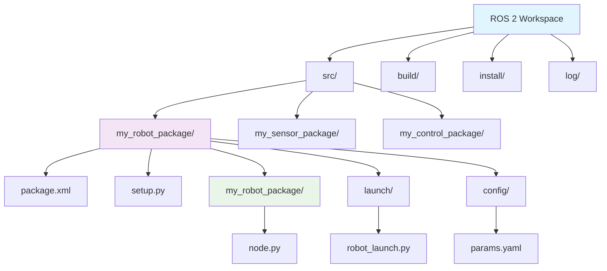
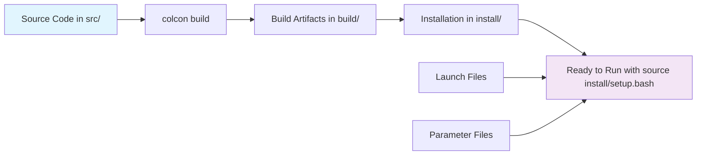

# Chapter 5: Building Real Packages

Welcome to the world of professional ROS 2 development! In this chapter, you'll master the essential tools for organizing and building ROS 2 code: workspaces, packages, colcon, launch files, and parameters. You'll learn to create properly structured ROS 2 packages, build them with colcon, and manage complex systems with launch files and parameter configurations. By the end of this chapter, you'll have created a complete workspace with functional packages, launch files, and parameters that can be built and run using colcon.

## Learning Objectives

After completing this chapter, you will be able to:
- Create and organize ROS 2 workspaces using proper directory structure
- Build packages with colcon, the multi-package build system for ROS 2
- Create both Python and C++ packages with proper package.xml and setup files
- Use launch files to start complex systems with multiple nodes
- Manage parameters through YAML configuration files
- Debug common package and build issues

## Why This Matters in 2025

Professional ROS 2 development requires understanding how to organize code into reusable, maintainable packages that can be built, tested, and deployed reliably. In 2025, with the growth of commercial robotics applications, the ability to create properly structured ROS 2 packages and workspaces is essential for developing production-ready robotic systems. Launch files and parameters allow you to configure complex robotic systems without hardcoding values, making your robots adaptable to different environments and use cases. These skills form the foundation of professional ROS 2 development practices used in industry.

## Colcon Workspace Definition in Plain English

### What is a Colcon Workspace?

**In Plain English:** A colcon workspace is like a project folder that contains all your ROS 2 packages, organized in a specific way so that the build system (colcon) can find and compile them together. Think of it as a container that holds all the pieces of your robot's software in an organized way.

**Technically:** A colcon workspace is a directory structure that follows ROS conventions, containing a `src/` directory where source packages are stored, and where colcon can build, install, and run those packages. It provides an isolated environment for building and running ROS 2 packages.

### What is Colcon?

**In Plain English:** Colcon is the tool that builds your ROS 2 packages. It's like a smart assistant that knows how to compile different types of code (Python, C++, etc.) and handles dependencies between packages automatically.

**Technically:** Colcon is a multi-package build system that provides a unified interface for building packages in various formats (ament_python, ament_cmake, catkin, etc.). It's the successor to catkin_make and provides better performance and flexibility.

## Colcon Workspace Creation (From Scratch)

Let's create a workspace from scratch and understand each component:

### Creating the Basic Workspace Structure

```bash
# Create the workspace directory
mkdir -p ~/ros2_workspace/src
cd ~/ros2_workspace

# The workspace structure should look like this:
# ros2_workspace/
# ├── src/          # Source packages go here
# ├── build/        # Build artifacts (created after building)
# ├── install/      # Installation directory (created after building)
# └── log/          # Build logs (created after building)
```

### Basic Workspace Commands

```bash
# Build all packages in the workspace
colcon build

# Build a specific package only
colcon build --packages-select my_package_name

# Build and install, then source the workspace
colcon build
source install/setup.bash

# Build with more verbose output (useful for debugging)
colcon build --event-handlers console_direct+

# Clean the build directory
rm -rf build/ install/ log/
```

## Mermaid Diagram: Package Structure



This diagram shows the typical structure of a ROS 2 workspace with multiple packages, each containing their own nodes, launch files, and configuration files.

## Mermaid Diagram: Build Process



This diagram illustrates the complete build process from source code to a runnable system.

## Python and C++ Package Templates

### Python Package Template

Let's create a complete Python package template:

```xml
<!-- File: my_python_package/package.xml -->
<?xml version="1.0"?>
<?xml-model href="http://download.ros.org/schema/package_format3.xsd" schematypens="http://www.w3.org/2001/XMLSchema"?>
<package format="3">
  <name>my_python_package</name>
  <version>0.0.0</version>
  <description>Example Python package for ROS 2</description>
  <maintainer email="user@example.com">Your Name</maintainer>
  <license>Apache License 2.0</license>

  <exec_depend>rclpy</exec_depend>
  <exec_depend>std_msgs</exec_depend>

  <test_depend>ament_copyright</test_depend>
  <test_depend>ament_flake8</test_depend>
  <test_depend>ament_pep257</test_depend>
  <test_depend>python3-pytest</test_depend>

  <export>
    <build_type>ament_python</build_type>
  </export>
</package>
```

```python
# File: my_python_package/setup.py
from setuptools import find_packages, setup

package_name = 'my_python_package'

setup(
    name=package_name,
    version='0.0.0',
    packages=find_packages(exclude=['test']),
    data_files=[
        ('share/ament_index/resource_index/packages',
            ['resource/' + package_name]),
        ('share/' + package_name, ['package.xml']),
    ],
    install_requires=['setuptools'],
    zip_safe=True,
    maintainer='Your Name',
    maintainer_email='user@example.com',
    description='Example Python package for ROS 2',
    license='Apache License 2.0',
    tests_require=['pytest'],
    entry_points={
        'console_scripts': [
            'my_node = my_python_package.my_node:main',
        ],
    },
)
```

```python
# File: my_python_package/my_python_package/my_node.py
import rclpy
from rclpy.node import Node
from std_msgs.msg import String


class MyNode(Node):
    def __init__(self):
        super().__init__('my_node')
        self.publisher = self.create_publisher(String, 'topic', 10)
        timer_period = 0.5  # seconds
        self.timer = self.create_timer(timer_period, self.timer_callback)
        self.i = 0

    def timer_callback(self):
        msg = String()
        msg.data = f'Hello World: {self.i}'
        self.publisher.publish(msg)
        self.get_logger().info(f'Publishing: "{msg.data}"')
        self.i += 1


def main(args=None):
    rclpy.init(args=args)
    my_node = MyNode()

    try:
        rclpy.spin(my_node)
    except KeyboardInterrupt:
        pass
    finally:
        my_node.destroy_node()
        rclpy.shutdown()


if __name__ == '__main__':
    main()
```

### C++ Package Template

Now let's create a complete C++ package template:

```xml
<!-- File: my_cpp_package/package.xml -->
<?xml version="1.0"?>
<?xml-model href="http://download.ros.org/schema/package_format3.xsd" schematypens="http://www.w3.org/2001/XMLSchema"?>
<package format="3">
  <name>my_cpp_package</name>
  <version>0.0.0</version>
  <description>Example C++ package for ROS 2</description>
  <maintainer email="user@example.com">Your Name</maintainer>
  <license>Apache License 2.0</license>

  <buildtool_depend>ament_cmake</buildtool_depend>

  <depend>rclcpp</depend>
  <depend>std_msgs</depend>

  <test_depend>ament_lint_auto</test_depend>
  <test_depend>ament_lint_common</test_depend>

  <export>
    <build_type>ament_cmake</build_type>
  </export>
</package>
```

```cmake
<!-- File: my_cpp_package/CMakeLists.txt -->
cmake_minimum_required(VERSION 3.8)
project(my_cpp_package)

if(CMAKE_COMPILER_IS_GNUCXX OR CMAKE_CXX_COMPILER_ID MATCHES "Clang")
  add_compile_options(-Wall -Wextra -Wpedantic)
endif()

# find dependencies
find_package(ament_cmake REQUIRED)
find_package(rclcpp REQUIRED)
find_package(std_msgs REQUIRED)

add_executable(my_cpp_node src/my_cpp_node.cpp)
ament_target_dependencies(my_cpp_node rclcpp std_msgs)

install(TARGETS
  my_cpp_node
  DESTINATION lib/${PROJECT_NAME}
)

if(BUILD_TESTING)
  find_package(ament_lint_auto REQUIRED)
  set(ament_cmake_copyright_FOUND TRUE)
  set(ament_cmake_flake8_FOUND TRUE)
  set(ament_cmake_pep257_FOUND TRUE)
  ament_lint_auto_find_test_dependencies()
endif()

ament_package()
```

```cpp
// File: my_cpp_package/src/my_cpp_node.cpp
#include <chrono>
#include <memory>
#include <string>

#include "rclcpp/rclcpp.hpp"
#include "std_msgs/msg/string.hpp"

using namespace std::chrono_literals;

class MyCppNode : public rclcpp::Node
{
public:
  MyCppNode()
  : Node("my_cpp_node"), count_(0)
  {
    publisher_ = this->create_publisher<std_msgs::msg::String>("topic", 10);
    timer_ = this->create_wall_timer(
      500ms, std::bind(&MyCppNode::timer_callback, this));
  }

private:
  void timer_callback()
  {
    auto message = std_msgs::msg::String();
    message.data = "Hello World: " + std::to_string(count_++);
    RCLCPP_INFO(this->get_logger(), "Publishing: '%s'", message.data.c_str());
    publisher_->publish(message);
  }
  rclcpp::TimerBase::SharedPtr timer_;
  rclcpp::Publisher<std_msgs::msg::String>::SharedPtr publisher_;
  size_t count_;
};

int main(int argc, char * argv[])
{
  rclcpp::init(argc, argv);
  rclcpp::spin(std::make_shared<MyCppNode>());
  rclcpp::shutdown();
  return 0;
}
```

## Launch Files and Parameter Management (YAML Configs)

### Basic Launch File Structure

Launch files allow you to start multiple nodes with specific configurations:

```python
# File: my_robot_package/launch/my_launch_file.launch.py
from launch import LaunchDescription
from launch.actions import DeclareLaunchArgument
from launch.substitutions import LaunchConfiguration
from launch_ros.actions import Node


def generate_launch_description():
    # Declare launch arguments
    use_sim_time = DeclareLaunchArgument(
        'use_sim_time',
        default_value='false',
        description='Use simulation (Gazebo) clock if true'
    )

    # Create nodes
    my_node = Node(
        package='my_python_package',
        executable='my_node',
        name='my_node',
        output='screen',
        parameters=[
            {'use_sim_time': LaunchConfiguration('use_sim_time')},
            # Additional parameters can be loaded from YAML files
            # '/path/to/params.yaml'
        ]
    )

    # Return the launch description
    return LaunchDescription([
        use_sim_time,
        my_node
    ])
```

### Advanced Launch File with Multiple Nodes

```python
# File: my_robot_package/launch/robot_system.launch.py
from launch import LaunchDescription
from launch.actions import DeclareLaunchArgument, IncludeLaunchDescription
from launch.launch_description_sources import PythonLaunchDescriptionSource
from launch.substitutions import LaunchConfiguration, PathJoinSubstitution
from launch_ros.actions import Node, ComposableNodeContainer
from launch_ros.descriptions import ComposableNode
from ament_index_python.packages import get_package_share_directory


def generate_launch_description():
    # Declare launch arguments
    use_sim_time = DeclareLaunchArgument(
        'use_sim_time',
        default_value='false',
        description='Use simulation (Gazebo) clock if true'
    )

    # Example: Create a container for composable nodes (components)
    container = ComposableNodeContainer(
        name='my_container',
        namespace='',
        package='rclcpp_components',
        executable='component_container_mt',
        composable_node_descriptions=[
            ComposableNode(
                package='my_cpp_package',
                plugin='MyPlugin',
                name='my_composable_node'
            )
        ],
        output='screen',
    )

    # Create individual nodes
    talker_node = Node(
        package='my_python_package',
        executable='my_node',
        name='talker',
        parameters=[{'use_sim_time': LaunchConfiguration('use_sim_time')}],
        remappings=[('topic', 'chatter')]
    )

    listener_node = Node(
        package='my_python_package',
        executable='my_node',  # This would be a different node in practice
        name='listener',
        parameters=[{'use_sim_time': LaunchConfiguration('use_sim_time')}],
        remappings=[('topic', 'chatter')]
    )

    return LaunchDescription([
        use_sim_time,
        container,
        talker_node,
        listener_node
    ])
```

### Parameter Configuration Files (YAML)

```yaml
# File: my_robot_package/config/robot_params.yaml
/**:  # Applies to all nodes
  ros__parameters:
    use_sim_time: false
    robot_name: "my_robot"
    loop_rate: 50

/my_node:  # Applies only to node named 'my_node'
  ros__parameters:
    publish_frequency: 10.0
    sensor_range: 3.0
    debug_mode: true
    thresholds:
      min_distance: 0.5
      max_distance: 10.0
    topics:
      input: "sensor_input"
      output: "sensor_output"
```

### Loading Parameters in Nodes

```python
# File: my_python_package/my_python_package/parameterized_node.py
import rclpy
from rclpy.node import Node
from std_msgs.msg import String


class ParameterizedNode(Node):
    def __init__(self):
        super().__init__('parameterized_node')

        # Declare parameters with default values
        self.declare_parameter('publish_frequency', 1.0)
        self.declare_parameter('robot_name', 'default_robot')
        self.declare_parameter('thresholds.min_distance', 0.5)

        # Get parameter values
        self.frequency = self.get_parameter('publish_frequency').value
        self.robot_name = self.get_parameter('robot_name').value
        self.min_distance = self.get_parameter('thresholds.min_distance').value

        # Create publisher
        self.publisher = self.create_publisher(String, 'parameterized_topic', 10)

        # Create timer based on parameter
        timer_period = 1.0 / self.frequency
        self.timer = self.create_timer(timer_period, self.timer_callback)

        self.i = 0
        self.get_logger().info(f'Initialized with robot_name: {self.robot_name}')

    def timer_callback(self):
        msg = String()
        msg.data = f'{self.robot_name}: {self.i}'
        self.publisher.publish(msg)
        self.get_logger().info(f'Published: "{msg.data}"')
        self.i += 1


def main(args=None):
    rclpy.init(args=args)
    node = ParameterizedNode()

    try:
        rclpy.spin(node)
    except KeyboardInterrupt:
        pass
    finally:
        node.destroy_node()
        rclpy.shutdown()


if __name__ == '__main__':
    main()
```

## Hands-On Example: Creating a Complete Workspace with Launch Files

Let's create a complete example that demonstrates all the concepts:

### Complete Workspace Structure

```
~/robot_workspace/
├── src/
│   ├── robot_description/
│   │   ├── package.xml
│   │   ├── CMakeLists.txt
│   │   └── urdf/
│   │       └── simple_robot.urdf.xacro
│   ├── robot_control/
│   │   ├── package.xml
│   │   ├── setup.py
│   │   ├── robot_control/
│   │   │   ├── __init__.py
│   │   │   └── controller.py
│   │   ├── launch/
│   │   │   └── robot_control.launch.py
│   │   └── config/
│   │       └── controller_params.yaml
│   └── robot_bringup/
│       ├── package.xml
│       ├── setup.py
│       └── launch/
│           └── complete_robot.launch.py
```

### Robot Description Package

```xml
<!-- File: robot_description/package.xml -->
<?xml version="1.0"?>
<?xml-model href="http://download.ros.org/schema/package_format3.xsd" schematypens="http://www.w3.org/2001/XMLSchema"?>
<package format="3">
  <name>robot_description</name>
  <version>0.0.0</version>
  <description>Robot description for our example robot</description>
  <maintainer email="user@example.com">Your Name</maintainer>
  <license>Apache License 2.0</license>

  <buildtool_depend>ament_cmake</buildtool_depend>

  <export>
    <build_type>ament_cmake</build_type>
  </export>
</package>
```

```xml
<!-- File: robot_description/urdf/simple_robot.urdf.xacro -->
<?xml version="1.0"?>
<robot xmlns:xacro="http://www.ros.org/wiki/xacro" name="simple_robot">
  <material name="blue">
    <color rgba="0 0 0.8 1.0"/>
  </material>
  <material name="black">
    <color rgba="0 0 0 1.0"/>
  </material>
  <material name="white">
    <color rgba="1 1 1 1.0"/>
  </material>

  <!-- Base Link -->
  <link name="base_link">
    <visual>
      <geometry>
        <cylinder radius="0.2" length="0.1"/>
      </geometry>
      <material name="white"/>
    </visual>
    <collision>
      <geometry>
        <cylinder radius="0.2" length="0.1"/>
      </geometry>
    </collision>
    <inertial>
      <mass value="10.0"/>
      <inertia ixx="1.0" ixy="0.0" ixz="0.0" iyy="1.0" iyz="0.0" izz="1.0"/>
    </inertial>
  </link>

  <!-- Sensor Link -->
  <joint name="sensor_joint" type="fixed">
    <parent link="base_link"/>
    <child link="sensor_link"/>
    <origin xyz="0.1 0 0.05" rpy="0 0 0"/>
  </joint>

  <link name="sensor_link">
    <visual>
      <geometry>
        <box size="0.05 0.05 0.05"/>
      </geometry>
      <material name="black"/>
    </visual>
  </link>
</robot>
```

### Robot Control Package

```xml
<!-- File: robot_control/package.xml -->
<?xml version="1.0"?>
<?xml-model href="http://download.ros.org/schema/package_format3.xsd" schematypens="http://www.w3.org/2001/XMLSchema"?>
<package format="3">
  <name>robot_control</name>
  <version>0.0.0</version>
  <description>Robot control package</description>
  <maintainer email="user@example.com">Your Name</maintainer>
  <license>Apache License 2.0</license>

  <exec_depend>rclpy</exec_depend>
  <exec_depend>std_msgs</exec_depend>
  <exec_depend>sensor_msgs</exec_depend>

  <export>
    <build_type>ament_python</build_type>
  </export>
</package>
```

```python
# File: robot_control/setup.py
from setuptools import find_packages, setup

package_name = 'robot_control'

setup(
    name=package_name,
    version='0.0.0',
    packages=find_packages(exclude=['test']),
    data_files=[
        ('share/ament_index/resource_index/packages',
            ['resource/' + package_name]),
        ('share/' + package_name, ['package.xml']),
        ('share/' + package_name + '/launch', ['launch/robot_control.launch.py']),
        ('share/' + package_name + '/config', ['config/controller_params.yaml']),
    ],
    install_requires=['setuptools'],
    zip_safe=True,
    maintainer='Your Name',
    maintainer_email='user@example.com',
    description='Robot control package',
    license='Apache License 2.0',
    entry_points={
        'console_scripts': [
            'robot_controller = robot_control.controller:main',
        ],
    },
)
```

```yaml
# File: robot_control/config/controller_params.yaml
/**:
  ros__parameters:
    control_frequency: 50.0
    max_velocity: 1.0
    safety_distance: 0.5
    pid:
      kp: 1.0
      ki: 0.1
      kd: 0.05
```

```python
# File: robot_control/robot_control/controller.py
import rclpy
from rclpy.node import Node
from geometry_msgs.msg import Twist
from sensor_msgs.msg import LaserScan


class RobotController(Node):
    def __init__(self):
        super().__init__('robot_controller')

        # Declare and get parameters
        self.declare_parameter('control_frequency', 50.0)
        self.declare_parameter('max_velocity', 1.0)
        self.declare_parameter('safety_distance', 0.5)

        self.control_frequency = self.get_parameter('control_frequency').value
        self.max_velocity = self.get_parameter('max_velocity').value
        self.safety_distance = self.get_parameter('safety_distance').value

        # Create publisher and subscriber
        self.cmd_vel_pub = self.create_publisher(Twist, 'cmd_vel', 10)
        self.scan_sub = self.create_subscription(
            LaserScan, 'scan', self.scan_callback, 10)

        # Create timer
        timer_period = 1.0 / self.control_frequency
        self.timer = self.create_timer(timer_period, self.control_loop)

        self.safety_stop = False
        self.get_logger().info(f'Controller initialized with max_velocity: {self.max_velocity}')

    def scan_callback(self, msg):
        # Simple obstacle detection
        if len(msg.ranges) > 0:
            min_range = min(msg.ranges)
            self.safety_stop = min_range < self.safety_distance

    def control_loop(self):
        cmd_vel = Twist()

        if self.safety_stop:
            # Stop the robot if obstacle is too close
            cmd_vel.linear.x = 0.0
            cmd_vel.angular.z = 0.0
        else:
            # Move forward at a safe speed
            cmd_vel.linear.x = min(self.max_velocity * 0.5, 0.5)
            cmd_vel.angular.z = 0.0

        self.cmd_vel_pub.publish(cmd_vel)


def main(args=None):
    rclpy.init(args=args)
    controller = RobotController()

    try:
        rclpy.spin(controller)
    except KeyboardInterrupt:
        pass
    finally:
        controller.destroy_node()
        rclpy.shutdown()


if __name__ == '__main__':
    main()
```

```python
# File: robot_control/launch/robot_control.launch.py
from launch import LaunchDescription
from launch.actions import DeclareLaunchArgument
from launch.substitutions import LaunchConfiguration
from launch_ros.actions import Node


def generate_launch_description():
    use_sim_time = DeclareLaunchArgument(
        'use_sim_time',
        default_value='false',
        description='Use simulation clock if true'
    )

    robot_controller = Node(
        package='robot_control',
        executable='robot_controller',
        name='robot_controller',
        parameters=[
            LaunchConfiguration('use_sim_time'),
            '/path/to/controller_params.yaml'  # In practice, you'd use PathJoinSubstitution
        ],
        output='screen'
    )

    return LaunchDescription([
        use_sim_time,
        robot_controller
    ])
```

### Robot Bringup Package

```xml
# File: robot_bringup/package.xml
<?xml version="1.0"?>
<?xml-model href="http://download.ros.org/schema/package_format3.xsd" schematypens="http://www.w3.org/2001/XMLSchema"?>
<package format="3">
  <name>robot_bringup</name>
  <version>0.0.0</version>
  <description>Robot bringup package to launch the complete system</description>
  <maintainer email="user@example.com">Your Name</maintainer>
  <license>Apache License 2.0</license>

  <exec_depend>robot_control</exec_depend>
  <exec_depend>robot_description</exec_depend>

  <export>
    <build_type>ament_python</build_type>
  </export>
</package>
```

```python
# File: robot_bringup/launch/complete_robot.launch.py
from launch import LaunchDescription
from launch.actions import IncludeLaunchDescription
from launch.launch_description_sources import PythonLaunchDescriptionSource
from launch.substitutions import PathJoinSubstitution
from launch_ros.substitutions import FindPackageShare


def generate_launch_description():
    # Include the robot control launch file
    robot_control_launch = IncludeLaunchDescription(
        PythonLaunchDescriptionSource([
            PathJoinSubstitution([
                FindPackageShare('robot_control'),
                'launch',
                'robot_control.launch.py'
            ])
        ])
    )

    # You could include other launch files here as well
    # For example, robot state publisher, joint state publisher, etc.

    return LaunchDescription([
        robot_control_launch,
    ])
```

### Building and Running the Complete System

```bash
# Navigate to the workspace
cd ~/robot_workspace

# Build all packages
colcon build --packages-select robot_description robot_control robot_bringup

# Source the workspace
source install/setup.bash

# Run the complete system
ros2 launch robot_bringup complete_robot.launch.py
```

## Common Mistakes and How to Fix Them

### Package.xml Issues

**Mistake**: Missing dependencies in package.xml
- **What you'll see**: Import errors or "package not found" errors
- **One-line fix**: Add the missing dependency with `<depend>package_name</depend>`

**Mistake**: Wrong format attribute
- **What you'll see**: Build errors or warnings about package format
- **One-line fix**: Ensure format="3" for ROS 2 packages

**Mistake**: Missing export section
- **What you'll see**: Package doesn't build correctly
- **One-line fix**: Add the export section with the correct build type

### Launch File Errors

**Mistake**: Incorrect package names in launch files
- **What you'll see**: "Package not found" errors when launching
- **One-line fix**: Verify package names match exactly what's in package.xml

**Mistake**: Wrong executable names
- **What you'll see**: "Executable not found" errors
- **One-line fix**: Check that executable names match console_scripts entries in setup.py

**Mistake**: Parameter path issues
- **What you'll see**: Parameters not loading correctly
- **One-line fix**: Use proper YAML structure and node name matching

### Build Issues

**Mistake**: CMakeLists.txt configuration errors
- **What you'll see**: Compilation errors during colcon build
- **One-line fix**: Ensure all required packages are found with find_package()

**Mistake**: Missing setup.py for Python packages
- **What you'll see**: Package not building as Python package
- **One-line fix**: Add proper setup.py with ament_python build type

## Verify Success

Run these commands to verify your workspace and packages work correctly:

```bash
# Check that your packages are found
colcon list

# Build your workspace
colcon build

# Source the workspace
source install/setup.bash

# Check available nodes
ros2 node list

# Check available launch files
ros2 launch --list

# Run a specific launch file
ros2 launch robot_bringup complete_robot.launch.py
```

If your packages build successfully and your launch files run without errors, you're ready for the next chapter!

## What's Next?

In Chapter 6, you'll learn how to bridge your Python AI agents to ROS 2 systems, connecting the package development skills you've learned here with AI decision-making capabilities. You'll create Python scripts that read sensor data from ROS 2 topics and send commands back to control a robot, demonstrating the complete AI-robot connection!

## Key Terms Defined

- **Workspace**: A directory containing ROS 2 packages in the src/ subdirectory
- **Package**: A reusable module containing nodes, libraries, and other resources
- **colcon**: The multi-package build system for ROS 2
- **Launch File**: A Python file that starts multiple nodes with specific configurations
- **Parameters**: Configuration values that can be set at runtime
- **ament_python**: Build type for Python packages in ROS 2
- **ament_cmake**: Build type for C++ packages in ROS 2
- **Console Scripts**: Executables defined in setup.py that become ROS 2 executables
- **Package.xml**: Manifest file describing package dependencies and metadata
- **CMakeLists.txt**: Build configuration file for C++ packages
- **YAML Configuration**: Parameter files in YAML format for node configuration

## Advanced Colcon Techniques

### Selective Building and Testing

For large workspaces with many packages, you can use selective building to save time:

```bash
# Build only specific packages
colcon build --packages-select my_package1 my_package2

# Build packages starting with a specific prefix
colcon build --packages-start-with my_robot_

# Skip specific packages during build
colcon build --packages-ignore package_to_ignore

# Build and test specific packages
colcon build --packages-select my_package --cmake-args -DBUILD_TESTING=ON
colcon test --packages-select my_package
colcon test-result --verbose  # View test results
```

### Workspace Isolation and Overlaying

ROS 2 supports workspace overlaying, which allows you to layer multiple workspaces:

```bash
# Build and source the base workspace
cd ~/base_workspace
colcon build
source install/setup.bash

# Build and source the overlay workspace
cd ~/overlay_workspace
colcon build
source install/setup.bash  # This overlays on top of the base workspace

# Check which packages are available
ros2 pkg list | grep my_package
```

Overlaying is useful when you want to modify specific packages without rebuilding the entire system.

### Advanced CMake Configuration

For C++ packages, you can pass additional CMake arguments:

```bash
# Build with debug symbols
colcon build --cmake-args -DCMAKE_BUILD_TYPE=Debug

# Build with optimizations
colcon build --cmake-args -DCMAKE_BUILD_TYPE=Release

# Enable compiler warnings
colcon build --cmake-args -DCMAKE_CXX_FLAGS="-Wall -Wextra"

# Build with custom installation prefix
colcon build --cmake-args -DCMAKE_INSTALL_PREFIX=/custom/path
```

## Package Development Best Practices

### Code Organization

Organize your packages following ROS 2 conventions:

```
my_robot_package/
├── CMakeLists.txt          # For C++ packages
├── package.xml            # Package manifest
├── setup.py               # For Python packages
├── setup.cfg              # For Python packages
├── my_robot_package/      # Python module
│   ├── __init__.py
│   ├── nodes/
│   │   ├── __init__.py
│   │   └── controller.py
│   ├── utils/
│   │   ├── __init__.py
│   │   └── helpers.py
│   └── interfaces/
│       ├── __init__.py
│       └── custom_msg.py
├── launch/
│   ├── robot_bringup.launch.py
│   └── navigation.launch.py
├── config/
│   ├── controller_params.yaml
│   └── sensor_params.yaml
├── urdf/                  # For robot description packages
│   └── robot.urdf.xacro
├── meshes/                # For 3D models
├── test/                  # Unit tests
│   ├── test_controller.py
│   └── test_navigation.cpp
└── scripts/               # Standalone scripts (not compiled)
    └── data_collector.py
```

### Naming Conventions

Follow these naming conventions for consistency:

- **Packages**: Use underscores, lowercase, descriptive names (e.g., `my_robot_control`)
- **Nodes**: Use underscores, lowercase (e.g., `robot_controller`)
- **Topics**: Use slashes to separate namespaces, lowercase (e.g., `/sensor/data`)
- **Parameters**: Use underscores, lowercase (e.g., `robot_speed_limit`)
- **Classes**: Use CamelCase (e.g., `RobotController`)
- **Functions/Variables**: Use underscores, lowercase (e.g., `calculate_trajectory`)

### Documentation Standards

Document your packages properly:

```xml
<!-- In package.xml -->
<description>
Complete sentence describing what the package does.
Include key features and use cases.
</description>

<maintainer email="developer@company.com">Developer Name</maintainer>
<license>Apache License 2.0</license>

<author email="contributor@company.com">Contributor Name</author>
```

```python
# In Python files
"""
Brief description of the module.

Detailed description of what this module provides,
how it works, and when to use it.

Examples:
    Basic usage example:
        from my_robot_package.controller import RobotController
        controller = RobotController()
        controller.move_forward()

Attributes:
    attribute_name (type): Description of attribute.

"""

class RobotController(Node):
    """
    Control robot movement and navigation.

    This class provides high-level movement commands
    for differential drive robots. It handles low-level
    details like velocity smoothing and safety checks.
    """
    def __init__(self):
        """Initialize the robot controller."""
        super().__init__('robot_controller')
        # Initialization code here
```

## Dependency Management

### Managing Dependencies in package.xml

Properly declare dependencies to ensure your packages work correctly:

```xml
<?xml version="1.0"?>
<?xml-model href="http://download.ros.org/schema/package_format3.xsd" schematypens="http://www.w3.org/2001/XMLSchema"?>
<package format="3">
  <name>my_complex_package</name>
  <version>1.0.0</version>
  <description>Complex package with multiple dependencies</description>
  <maintainer email="maintainer@company.com">Maintainer Name</maintainer>
  <license>Apache License 2.0</license>

  <!-- Build tool dependencies -->
  <buildtool_depend>ament_cmake</buildtool_depend>
  <buildtool_depend>ament_python</buildtool_depend>

  <!-- Build dependencies (needed to compile) -->
  <build_depend>rclcpp</build_depend>
  <build_depend>geometry_msgs</build_depend>

  <!-- Build export dependencies (needed by packages that depend on this) -->
  <build_export_depend>rclcpp</build_export_depend>

  <!-- Exec dependencies (needed to run) -->
  <exec_depend>rclpy</exec_depend>
  <exec_depend>std_msgs</exec_depend>
  <exec_depend>sensor_msgs</exec_depend>
  <exec_depend>geometry_msgs</exec_depend>
  <exec_depend>nav_msgs</exec_depend>
  <exec_depend>tf2_ros</exec_depend>

  <!-- Test dependencies -->
  <test_depend>ament_lint_auto</test_depend>
  <test_depend>ament_cmake_gtest</test_depend>
  <test_depend>python3-pytest</test_depend>

  <!-- Export information -->
  <export>
    <build_type>ament_cmake</build_type>
  </export>
</package>
```

### Python Dependencies

For Python packages, manage dependencies in setup.py:

```python
# File: setup.py
import os
from glob import glob
from setuptools import setup

package_name = 'my_python_package'

# Get all launch files
launch_files = glob(os.path.join('launch', '*launch.[pxy][yma]*'))

setup(
    name=package_name,
    version='1.0.0',
    packages=[package_name],
    data_files=[
        ('share/ament_index/resource_index/packages',
            ['resource/' + package_name]),
        ('share/' + package_name, ['package.xml']),
        # Include launch files
        (os.path.join('share', package_name, 'launch'), launch_files),
        # Include config files
        (os.path.join('share', package_name, 'config'),
         glob(os.path.join('config', '*.yaml'))),
    ],
    install_requires=[
        'setuptools',
        'numpy>=1.19.0',
        'scipy>=1.5.0',
        'opencv-python>=4.5.0',
        'pyyaml>=5.4.0',
    ],
    zip_safe=True,
    maintainer='Your Name',
    maintainer_email='your.email@company.com',
    description='Complex Python package with dependencies',
    license='Apache License 2.0',
    tests_require=['pytest'],
    entry_points={
        'console_scripts': [
            'robot_controller = my_python_package.nodes.controller:main',
            'sensor_processor = my_python_package.nodes.sensor_processor:main',
            'data_analyzer = my_python_package.tools.analyzer:main',
        ],
    },
)
```

## Continuous Integration and Testing

### Unit Testing

Create comprehensive unit tests for your packages:

```python
# File: test/test_controller.py
import unittest
import rclpy
from rclpy.executors import SingleThreadedExecutor
from my_robot_package.controller import RobotController


class TestRobotController(unittest.TestCase):
    def setUp(self):
        """Set up test fixtures before each test method."""
        rclpy.init()
        self.controller = RobotController()
        self.executor = SingleThreadedExecutor()
        self.executor.add_node(self.controller)

    def tearDown(self):
        """Clean up after each test method."""
        self.controller.destroy_node()
        rclpy.shutdown()

    def test_initialization(self):
        """Test that controller initializes correctly."""
        self.assertIsNotNone(self.controller)
        self.assertEqual(self.controller.get_parameter('max_velocity').value, 1.0)

    def test_move_forward(self):
        """Test forward movement command."""
        initial_cmd = self.controller.cmd_vel_pub.value
        self.controller.move_forward()
        # Add assertions based on expected behavior

    def test_safety_stop(self):
        """Test safety stop functionality."""
        self.controller.safety_stop = True
        cmd_vel = self.controller.get_movement_command()
        self.assertEqual(cmd_vel.linear.x, 0.0)
        self.assertEqual(cmd_vel.angular.z, 0.0)


def test_suite():
    """Create test suite for RobotController."""
    loader = unittest.TestLoader()
    suite = loader.loadTestsFromTestCase(TestRobotController)
    return suite


if __name__ == '__main__':
    unittest.main()
```

### CI Configuration

Create a .github/workflows/ci.yml file for continuous integration:

```yaml
name: ROS 2 CI

on:
  push:
    branches: [ main, develop ]
  pull_request:
    branches: [ main ]

jobs:
  test:
    runs-on: ubuntu-latest
    strategy:
      matrix:
        ros_distribution: [humble]
        include:
          - docker_image: ros:humble
            ros_version: 2
    container:
      image: ${{ matrix.docker_image }}

    steps:
      - uses: actions/checkout@v3

      - name: Setup ROS
        uses: ros-tooling/setup-ros@v0.7
        with:
          required-ros-distributions: ${{ matrix.ros_distribution }}

      - name: Install dependencies
        run: |
          sudo apt-get update
          rosdep update
          rosdep install --from-paths src --ignore-src -r -y

      - name: Build packages
        run: colcon build --symlink-install --packages-select my_robot_package

      - name: Run tests
        run: colcon test --packages-select my_robot_package && colcon test-result --verbose
```

## Performance Optimization

### Efficient Node Design

Design your nodes for optimal performance:

```python
# Efficient node implementation
import rclpy
from rclpy.node import Node
from rclpy.qos import QoSProfile, QoSDurabilityPolicy
from std_msgs.msg import String
import time


class EfficientNode(Node):
    def __init__(self):
        super().__init__('efficient_node')

        # Use appropriate QoS profiles
        qos_profile = QoSProfile(
            depth=10,
            durability=QoSDurabilityPolicy.VOLATILE
        )

        self.publisher = self.create_publisher(
            String, 'topic', qos_profile
        )

        # Batch processing to reduce overhead
        self.message_buffer = []
        self.buffer_size = 5

        # Use efficient timers
        self.process_timer = self.create_timer(
            0.05,  # 20 Hz processing
            self.process_batch
        )

        self.counter = 0

    def process_batch(self):
        """Process messages in batches for efficiency."""
        if self.message_buffer:
            # Process all buffered messages
            for msg in self.message_buffer:
                self.publisher.publish(msg)
            self.message_buffer.clear()

    def add_to_buffer(self, msg):
        """Add message to processing buffer."""
        self.message_buffer.append(msg)
        if len(self.message_buffer) >= self.buffer_size:
            self.process_batch()


def main(args=None):
    rclpy.init(args=args)
    node = EfficientNode()

    try:
        rclpy.spin(node)
    except KeyboardInterrupt:
        pass
    finally:
        node.destroy_node()
        rclpy.shutdown()


if __name__ == '__main__':
    main()
```

### Memory Management

Follow memory management best practices:

```python
class ResourceAwareNode(Node):
    def __init__(self):
        super().__init__('resource_aware_node')

        # Pre-allocate objects to avoid frequent allocation
        self.msg_cache = String()

        # Set up cleanup timer
        self.cleanup_timer = self.create_timer(5.0, self.cleanup_resources)

    def cleanup_resources(self):
        """Periodically clean up resources."""
        # Clear caches, close files, etc.
        pass

    def destroy_node(self):
        """Clean up resources when node is destroyed."""
        # Close any open files or connections
        # Cancel timers
        if hasattr(self, 'cleanup_timer'):
            self.cleanup_timer.cancel()
        super().destroy_node()
```

## Deployment and Release

### Creating Debian Packages

For deployment, you can create Debian packages:

```yaml
# File: bloom/groovy/release/my_robot_package/release.yaml
Release:
  my_robot_package:
    version: 1.0.0-1
    tags:
      release: release/humble/{package}/{version}
    vcs_uri: https://github.com/user/my_robot_package.git
    vcs_type: git
    condition: ROS_DISTRO == 'humble'
```

### Version Management

Follow semantic versioning for your packages:

- **MAJOR.MINOR.PATCH** format
- Increment MAJOR when making incompatible API changes
- Increment MINOR when adding functionality in a backward-compatible manner
- Increment PATCH when making backward-compatible bug fixes

## Troubleshooting Common Issues

### Build Problems

**Issue**: Circular dependencies between packages
- **Symptoms**: Build fails with linking errors
- **Solution**: Refactor to use a common dependency package

**Issue**: Mixed Python/C++ workspace problems
- **Symptoms**: Import errors after sourcing
- **Solution**: Build C++ packages first, then Python packages

**Issue**: Permission denied during build
- **Symptoms**: Build fails with permission errors
- **Solution**: Check file permissions in workspace

### Runtime Issues

**Issue**: Nodes can't find parameters
- **Symptoms**: Default parameter values used
- **Solution**: Check parameter file paths and node names

**Issue**: Launch files not found
- **Symptoms**: "No launch files found" error
- **Solution**: Verify data_files in setup.py includes launch files

**Issue**: Package not found after build
- **Symptoms**: ros2 command can't find package
- **Solution**: Check that workspace is properly sourced

## Summary and Best Practices

In this comprehensive chapter, you've learned:
- How to create and organize ROS 2 workspaces professionally
- How to build packages with colcon efficiently
- How to create both Python and C++ packages with proper structure
- How to use launch files to orchestrate complex systems
- How to manage parameters through YAML configuration files
- Advanced techniques for optimization and troubleshooting
- Best practices for professional ROS 2 development

You now have the skills to create, build, and organize ROS 2 packages professionally, and how to use launch files and parameters to manage complex robotic systems. These skills are essential for any professional robotics engineer working with production systems.

Great job mastering professional ROS 2 development! You now understand how to create, build, and organize ROS 2 packages professionally, and how to use launch files and parameters to manage complex robotic systems. These skills are essential for any professional robotics engineer.