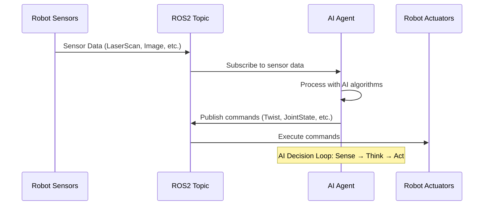

# Chapter 6: Bridging AI Agents to ROS 2

Welcome to the exciting intersection of AI and robotics! In this chapter, you'll learn how to connect your Python AI agents to ROS 2 systems, creating the bridge that allows your digital intelligence to take physical action in the real world. You'll master the techniques to read sensor data from ROS 2 topics, process it with your AI agents, and send commands back to control robotic systems. By the end of this chapter, you'll have built a complete AI-robot integration that demonstrates the full loop: sensors → AI → actuators.

## Learning Objectives

After completing this chapter, you will be able to:
- Connect Python AI agents to ROS 2 topics for bidirectional communication
- Read sensor data from ROS 2 topics and integrate it into AI decision-making loops
- Send commands from AI agents to control robot actuators via ROS 2 messages
- Handle timing and synchronization between AI processing and robot control
- Debug common issues in AI-robot integration systems
- Design robust AI-robot communication architectures

## Why This Matters in 2025

In 2025, the bridge between AI and physical systems is more critical than ever. While large language models and neural networks excel at processing information and generating insights, the next frontier is connecting this digital intelligence to physical robots that can act in the real world. The integration you'll learn in this chapter enables your AI agents to:

- **Perceive the world**: Read sensor data from cameras, LIDAR, IMUs, and other sensors
- **Make intelligent decisions**: Process sensor information using AI algorithms
- **Take physical action**: Send commands to robot actuators to manipulate the environment
- **Learn from experience**: Receive feedback from the physical world to improve AI performance

This AI-to-physical-action bridge is what transforms static AI systems into embodied intelligence that can interact with and change the physical world. It's the foundation of autonomous vehicles, warehouse robots, service robots, and countless other applications where digital intelligence must manifest as physical action.

## AI-Agent to ROS 2 Integration Definition in Plain English

### What is AI-ROS Integration?

**In Plain English:** AI-ROS integration is like giving your AI agent eyes, ears, and hands by connecting it to a robot. Your AI code reads what the robot senses (through sensors), thinks about what to do, and then tells the robot how to move or act (through commands). It's the connection between your AI's brain and the robot's body.

**Technically:** AI-ROS integration involves creating ROS 2 nodes that subscribe to sensor topics, process data using AI algorithms, and publish command messages to actuator topics. This creates a feedback loop where sensor data → AI processing → commands → robot action → new sensor data.

### Key Components of AI-ROS Integration

1. **Sensor Interface**: ROS 2 subscribers that receive data from robot sensors
2. **AI Processing**: Your AI algorithms that make decisions based on sensor data
3. **Command Interface**: ROS 2 publishers that send commands to robot actuators
4. **Timing Coordination**: Synchronization between AI processing and robot control rates

## Python Agent → ROS 2 Node Conversion (20 Lines Example)

Here's a complete example of converting a simple Python AI agent into a ROS 2 node:

```python
# File: ai_robot_bridge.py
import rclpy
from rclpy.node import Node
from sensor_msgs.msg import LaserScan
from geometry_msgs.msg import Twist
import numpy as np

class AIBridgeNode(Node):
    def __init__(self):
        super().__init__('ai_robot_bridge')

        # Create subscriber for laser scan data
        self.scan_sub = self.create_subscription(
            LaserScan, '/scan', self.scan_callback, 10)

        # Create publisher for velocity commands
        self.cmd_pub = self.create_publisher(Twist, '/cmd_vel', 10)

        # AI processing timer (10 Hz)
        self.timer = self.create_timer(0.1, self.ai_processing_loop)

        self.latest_scan = None
        self.get_logger().info("AI-Robot Bridge initialized")

    def scan_callback(self, msg):
        """Receive sensor data from robot."""
        self.latest_scan = msg.ranges

    def ai_processing_loop(self):
        """AI decision-making and command generation."""
        if self.latest_scan is not None:
            # Simple AI: move forward if clear path, turn otherwise
            min_distance = min(self.latest_scan)

            cmd = Twist()
            if min_distance > 1.0:  # Safe distance
                cmd.linear.x = 0.5   # Move forward
                cmd.angular.z = 0.0  # No turn
            else:  # Obstacle detected
                cmd.linear.x = 0.0   # Stop
                cmd.angular.z = 0.5  # Turn away

            self.cmd_pub.publish(cmd)

def main(args=None):
    rclpy.init(args=args)
    ai_bridge = AIBridgeNode()

    try:
        rclpy.spin(ai_bridge)
    except KeyboardInterrupt:
        pass
    finally:
        ai_bridge.destroy_node()
        rclpy.shutdown()

if __name__ == '__main__':
    main()
```

This example demonstrates the complete integration pattern: sensor data flows into the AI agent, which processes the information and sends commands back to the robot.

## Mermaid Diagram: AI-ROS Integration

```mermaid
graph TB
    subgraph "Physical Robot"
        A[Sensors: Camera, LIDAR, IMU] --> B[ROS 2 Topics]
        C[Actuators: Motors, Servos] <-- D[ROS 2 Topics]
    end

    subgraph "AI-Agent Integration"
        B --> E[AI Agent Node]
        E --> F[AI Processing: Perception, Planning, Control]
        F --> E
        E --> D
    end

    subgraph "AI Decision Loop"
        G[Receive Sensor Data] --> H[AI Decision Making]
        H --> I[Send Command]
        I --> G
    end

    style A fill:#e1f5fe
    style C fill:#f3e5f5
    style E fill:#fff3e0
```

This diagram shows the complete flow of information in an AI-robot integration system. Sensor data flows from the physical robot through ROS 2 topics to the AI agent, which processes the information and sends commands back to control the robot's actuators.

## Mermaid Diagram: Message Flow



This sequence diagram illustrates the timing and flow of messages in an AI-robot integration system, showing how sensor data flows to the AI agent and commands flow back to the robot.

## Velocity Commands Section (Twist Messages)

### Understanding Twist Messages

The `geometry_msgs/Twist` message is the standard way to send velocity commands to mobile robots in ROS 2. It contains both linear and angular velocity components:

```python
from geometry_msgs.msg import Twist

# Create a twist message
twist = Twist()

# Linear velocities (m/s)
twist.linear.x = 1.0   # Forward/backward (positive = forward)
twist.linear.y = 0.0   # Left/right (positive = left)
twist.linear.z = 0.0   # Up/down (positive = up)

# Angular velocities (rad/s)
twist.angular.x = 0.0  # Roll
twist.angular.y = 0.0  # Pitch
twist.angular.z = 0.5  # Yaw (positive = counter-clockwise)
```

### Common Velocity Command Patterns

```python
def create_velocity_commands(self, ai_decision):
    """Convert AI decisions to robot velocity commands."""
    cmd = Twist()

    # Example: AI outputs desired linear and angular velocities
    if ai_decision == "move_forward":
        cmd.linear.x = 0.5
        cmd.angular.z = 0.0
    elif ai_decision == "turn_left":
        cmd.linear.x = 0.0
        cmd.angular.z = 0.5
    elif ai_decision == "turn_right":
        cmd.linear.x = 0.0
        cmd.angular.z = -0.5
    elif ai_decision == "stop":
        cmd.linear.x = 0.0
        cmd.angular.z = 0.0
    elif ai_decision == "avoid_obstacle":
        # Use AI to calculate avoidance maneuver
        cmd.linear.x = 0.2  # Slow forward
        cmd.angular.z = 0.8  # Sharp turn

    return cmd
```

### Advanced Velocity Control

For more sophisticated control, you can implement velocity profiles:

```python
class SmoothController:
    def __init__(self):
        self.current_linear = 0.0
        self.current_angular = 0.0
        self.max_linear_acc = 0.5  # m/s^2
        self.max_angular_acc = 1.0  # rad/s^2

    def smooth_velocity(self, target_linear, target_angular, dt):
        """Apply acceleration limits for smooth motion."""
        # Calculate required acceleration
        lin_acc = (target_linear - self.current_linear) / dt
        ang_acc = (target_angular - self.current_angular) / dt

        # Limit acceleration
        lin_acc = max(-self.max_linear_acc, min(self.max_linear_acc, lin_acc))
        ang_acc = max(-self.max_angular_acc, min(self.max_angular_acc, ang_acc))

        # Update velocities
        self.current_linear += lin_acc * dt
        self.current_angular += ang_acc * dt

        cmd = Twist()
        cmd.linear.x = self.current_linear
        cmd.angular.z = self.current_angular

        return cmd
```

## Sensor Data Reading Section (JointState into Agent Loop)

### Reading Different Sensor Types

```python
import rclpy
from rclpy.node import Node
from sensor_msgs.msg import LaserScan, Image, Imu, JointState
from cv_bridge import CvBridge
import numpy as np

class SensorFusionNode(Node):
    def __init__(self):
        super().__init__('sensor_fusion_node')

        # Initialize sensor data storage
        self.laser_data = None
        self.camera_data = None
        self.imu_data = None
        self.joint_states = None

        # Create subscribers for different sensor types
        self.scan_sub = self.create_subscription(
            LaserScan, '/scan', self.laser_callback, 10)

        self.image_sub = self.create_subscription(
            Image, '/camera/image_raw', self.camera_callback, 10)

        self.imu_sub = self.create_subscription(
            Imu, '/imu/data', self.imu_callback, 10)

        self.joint_sub = self.create_subscription(
            JointState, '/joint_states', self.joint_callback, 10)

        # Timer for AI processing loop
        self.ai_timer = self.create_timer(0.1, self.ai_processing_loop)

        # CV bridge for image processing
        self.cv_bridge = CvBridge()

        self.get_logger().info("Sensor fusion node initialized")

    def laser_callback(self, msg):
        """Process laser scanner data."""
        self.laser_data = np.array(msg.ranges)
        # Filter out invalid ranges
        self.laser_data[self.laser_data == float('inf')] = 0

    def camera_callback(self, msg):
        """Process camera image data."""
        try:
            # Convert ROS Image to OpenCV format
            cv_image = self.cv_bridge.imgmsg_to_cv2(msg, "bgr8")
            self.camera_data = cv_image
        except Exception as e:
            self.get_logger().error(f"Could not convert image: {e}")

    def imu_callback(self, msg):
        """Process IMU data."""
        self.imu_data = {
            'orientation': [msg.orientation.x, msg.orientation.y,
                           msg.orientation.z, msg.orientation.w],
            'angular_velocity': [msg.angular_velocity.x, msg.angular_velocity.y,
                                msg.angular_velocity.z],
            'linear_acceleration': [msg.linear_acceleration.x,
                                   msg.linear_acceleration.y,
                                   msg.linear_acceleration.z]
        }

    def joint_callback(self, msg):
        """Process joint state data."""
        self.joint_states = {}
        for i, name in enumerate(msg.name):
            self.joint_states[name] = {
                'position': msg.position[i] if i < len(msg.position) else 0.0,
                'velocity': msg.velocity[i] if i < len(msg.velocity) else 0.0,
                'effort': msg.effort[i] if i < len(msg.effort) else 0.0
            }

    def ai_processing_loop(self):
        """Main AI processing loop that integrates all sensor data."""
        if not all([self.laser_data, self.camera_data, self.imu_data, self.joint_states]):
            return  # Wait for all sensors to initialize

        # Combine sensor data for AI processing
        sensor_input = {
            'laser': self.laser_data,
            'image': self.camera_data,
            'imu': self.imu_data,
            'joints': self.joint_states
        }

        # Process with AI agent
        ai_decision = self.run_ai_agent(sensor_input)

        # Execute decision
        self.execute_decision(ai_decision)

    def run_ai_agent(self, sensor_input):
        """Placeholder for AI agent logic."""
        # This is where your AI algorithm would run
        # Example: simple obstacle avoidance
        if sensor_input['laser'] is not None:
            min_distance = np.min(sensor_input['laser'])
            if min_distance < 0.5:
                return "turn_away"
            else:
                return "move_forward"
        return "stop"

    def execute_decision(self, decision):
        """Execute AI decision by sending commands to robot."""
        cmd = Twist()
        if decision == "move_forward":
            cmd.linear.x = 0.5
        elif decision == "turn_away":
            cmd.angular.z = 0.5
        else:
            cmd.linear.x = 0.0
            cmd.angular.z = 0.0

        # Publish command (assuming cmd_vel publisher exists)
        # self.cmd_pub.publish(cmd)
```

### Timing Considerations

When integrating sensor data into AI loops, timing is crucial:

```python
from collections import deque
import time

class TimedSensorProcessor:
    def __init__(self):
        self.sensor_buffer = deque(maxlen=10)  # Store last 10 sensor readings
        self.last_ai_time = time.time()
        self.ai_interval = 0.1  # 10 Hz AI processing

    def add_sensor_reading(self, sensor_data, timestamp=None):
        """Add sensor reading with timestamp."""
        if timestamp is None:
            timestamp = time.time()
        self.sensor_buffer.append((timestamp, sensor_data))

    def get_recent_sensor_data(self, time_window=0.5):
        """Get sensor data within specified time window."""
        current_time = time.time()
        recent_data = []

        for timestamp, data in self.sensor_buffer:
            if current_time - timestamp <= time_window:
                recent_data.append(data)

        return recent_data

    def should_run_ai(self):
        """Check if it's time to run AI processing."""
        current_time = time.time()
        if current_time - self.last_ai_time >= self.ai_interval:
            self.last_ai_time = current_time
            return True
        return False
```

## Hands-On Example: Connecting a Simple AI Agent to ROS 2

Let's create a complete example that demonstrates AI-robot integration:

### Complete AI-Robot Integration Node

```python
#!/usr/bin/env python3
# File: ai_robot_integration_demo.py

import rclpy
from rclpy.node import Node
from sensor_msgs.msg import LaserScan
from geometry_msgs.msg import Twist
from std_msgs.msg import Float32MultiArray
import numpy as np
import math
from typing import List, Tuple, Dict

class AIAgentNode(Node):
    """
    Complete AI agent that integrates sensor data and controls robot movement.
    Implements obstacle avoidance, goal seeking, and path planning.
    """

    def __init__(self):
        super().__init__('ai_agent_node')

        # Parameters
        self.declare_parameter('ai_update_rate', 10.0)  # Hz
        self.declare_parameter('safety_distance', 0.5)  # meters
        self.declare_parameter('goal_tolerance', 0.2)   # meters

        self.ai_rate = self.get_parameter('ai_update_rate').value
        self.safety_dist = self.get_parameter('safety_distance').value
        self.goal_tolerance = self.get_parameter('goal_tolerance').value

        # Robot state
        self.scan_data = None
        self.current_goal = [5.0, 3.0]  # x, y coordinates
        self.robot_pose = [0.0, 0.0, 0.0]  # x, y, theta
        self.obstacles = []

        # Create publishers and subscribers
        self.scan_sub = self.create_subscription(
            LaserScan, '/scan', self.scan_callback, 10)

        self.cmd_pub = self.create_publisher(Twist, '/cmd_vel', 10)

        self.goal_pub = self.create_publisher(Float32MultiArray, '/current_goal', 10)

        # AI processing timer
        self.ai_timer = self.create_timer(1.0/self.ai_rate, self.ai_control_loop)

        # Statistics
        self.distance_traveled = 0.0
        self.collision_warnings = 0

        self.get_logger().info(f"AI Agent initialized with {self.ai_rate}Hz control rate")
        self.publish_goal()

    def scan_callback(self, msg):
        """Process incoming laser scan data."""
        # Convert scan ranges to Cartesian coordinates
        angles = np.linspace(msg.angle_min, msg.angle_max, len(msg.ranges))
        valid_ranges = []

        for i, range_val in enumerate(msg.ranges):
            if msg.range_min <= range_val <= msg.range_max:
                angle = angles[i]
                x = range_val * math.cos(angle)
                y = range_val * math.sin(angle)
                valid_ranges.append((x, y))

        self.scan_data = valid_ranges

    def ai_control_loop(self):
        """Main AI control loop that processes sensor data and generates commands."""
        if self.scan_data is None:
            # No sensor data yet, send stop command
            self.stop_robot()
            return

        # Process sensor data
        processed_data = self.process_sensor_data()

        # Make AI decision
        decision = self.make_ai_decision(processed_data)

        # Execute decision
        self.execute_decision(decision)

        # Update statistics
        self.update_statistics()

    def process_sensor_data(self) -> Dict:
        """Process raw sensor data into useful information for AI."""
        if not self.scan_data:
            return {}

        # Analyze obstacles
        obstacles = []
        front_clear = True

        for x, y in self.scan_data:
            distance = math.sqrt(x*x + y*y)
            if distance < self.safety_dist:
                obstacles.append((x, y, distance))
                if abs(y) < 0.5:  # Front-facing region
                    front_clear = False

        # Calculate distances in different directions
        front_distances = []
        left_distances = []
        right_distances = []

        for x, y in self.scan_data:
            distance = math.sqrt(x*x + y*y)
            if -0.5 <= y <= 0.5 and x > 0:  # Front
                front_distances.append(distance)
            elif y > 0:  # Left
                left_distances.append(distance)
            else:  # Right
                right_distances.append(distance)

        processed_data = {
            'obstacles': obstacles,
            'front_clear': front_clear,
            'front_distance': min(front_distances) if front_distances else float('inf'),
            'left_distance': min(left_distances) if left_distances else float('inf'),
            'right_distance': min(right_distances) if right_distances else float('inf'),
            'nearest_obstacle': min([obs[2] for obs in obstacles]) if obstacles else float('inf'),
            'has_obstacles': len(obstacles) > 0
        }

        return processed_data

    def make_ai_decision(self, sensor_data: Dict) -> str:
        """Make high-level decisions based on sensor data."""
        # Calculate vector to goal
        dx = self.current_goal[0] - self.robot_pose[0]
        dy = self.current_goal[1] - self.robot_pose[1]
        dist_to_goal = math.sqrt(dx*dx + dy*dy)

        # Check if goal reached
        if dist_to_goal < self.goal_tolerance:
            return "goal_reached"

        # Check for imminent collision
        if sensor_data['nearest_obstacle'] < self.safety_dist * 0.7:
            return "emergency_stop"

        # Check for obstacles in path
        if sensor_data['has_obstacles'] and not sensor_data['front_clear']:
            # Need to avoid obstacle
            if sensor_data['left_distance'] > sensor_data['right_distance']:
                return "turn_left_avoid"
            else:
                return "turn_right_avoid"

        # Clear path to goal, move toward it
        return "move_toward_goal"

    def execute_decision(self, decision: str):
        """Execute AI decision by sending appropriate commands."""
        cmd = Twist()

        if decision == "goal_reached":
            # Reached goal, stop and celebrate
            cmd.linear.x = 0.0
            cmd.angular.z = 0.0
            self.get_logger().info("Goal reached!")

        elif decision == "emergency_stop":
            # Immediate stop for safety
            cmd.linear.x = 0.0
            cmd.angular.z = 0.0
            self.collision_warnings += 1
            self.get_logger().warn("Emergency stop activated!")

        elif decision == "turn_left_avoid":
            # Turn left to avoid obstacle
            cmd.linear.x = 0.1  # Slow forward
            cmd.angular.z = 0.8  # Turn left

        elif decision == "turn_right_avoid":
            # Turn right to avoid obstacle
            cmd.linear.x = 0.1  # Slow forward
            cmd.angular.z = -0.8  # Turn right

        elif decision == "move_toward_goal":
            # Move toward goal with obstacle awareness
            cmd.linear.x = 0.5
            cmd.angular.z = 0.0  # Will be adjusted based on goal direction

            # Calculate direction to goal (simplified)
            dx = self.current_goal[0] - self.robot_pose[0]
            dy = self.current_goal[1] - self.robot_pose[1]

            # Simple proportional control for orientation
            goal_angle = math.atan2(dy, dx)
            current_angle = self.robot_pose[2]

            angle_error = goal_angle - current_angle
            # Normalize angle to [-pi, pi]
            while angle_error > math.pi:
                angle_error -= 2 * math.pi
            while angle_error < -math.pi:
                angle_error += 2 * math.pi

            # Apply proportional control
            cmd.angular.z = max(-1.0, min(1.0, angle_error * 1.0))  # Kp = 1.0

        # Publish command
        self.cmd_pub.publish(cmd)

    def stop_robot(self):
        """Send stop command to robot."""
        cmd = Twist()
        cmd.linear.x = 0.0
        cmd.angular.z = 0.0
        self.cmd_pub.publish(cmd)

    def update_statistics(self):
        """Update performance statistics."""
        # In a real implementation, you would track actual movement
        # This is simplified for demonstration
        pass

    def publish_goal(self):
        """Publish current goal for visualization."""
        goal_msg = Float32MultiArray()
        goal_msg.data = [float(x) for x in self.current_goal]
        self.goal_pub.publish(goal_msg)

def main(args=None):
    rclpy.init(args=args)

    ai_agent = AIAgentNode()

    try:
        rclpy.spin(ai_agent)
    except KeyboardInterrupt:
        ai_agent.get_logger().info("Shutting down AI agent...")
    finally:
        ai_agent.stop_robot()
        ai_agent.destroy_node()
        rclpy.shutdown()

if __name__ == '__main__':
    main()
```

### Launch File for the AI Integration Demo

```python
# File: launch/ai_robot_integration.launch.py
from launch import LaunchDescription
from launch.actions import DeclareLaunchArgument
from launch.substitutions import LaunchConfiguration
from launch_ros.actions import Node


def generate_launch_description():
    # Declare launch arguments
    use_sim_time = DeclareLaunchArgument(
        'use_sim_time',
        default_value='false',
        description='Use simulation (Gazebo) clock if true'
    )

    ai_update_rate = DeclareLaunchArgument(
        'ai_update_rate',
        default_value='10.0',
        description='AI control loop update rate (Hz)'
    )

    safety_distance = DeclareLaunchArgument(
        'safety_distance',
        default_value='0.5',
        description='Minimum safe distance to obstacles (meters)'
    )

    # Create AI agent node
    ai_agent_node = Node(
        package='your_robot_package',  # Replace with your package name
        executable='ai_robot_integration_demo',
        name='ai_agent_node',
        parameters=[
            {'ai_update_rate': LaunchConfiguration('ai_update_rate')},
            {'safety_distance': LaunchConfiguration('safety_distance')},
            {'use_sim_time': LaunchConfiguration('use_sim_time')}
        ],
        remappings=[
            ('/scan', '/laser_scan'),  # Adjust based on your robot
            ('/cmd_vel', '/cmd_vel')   # Adjust based on your robot
        ],
        output='screen'
    )

    return LaunchDescription([
        use_sim_time,
        ai_update_rate,
        safety_distance,
        ai_agent_node
    ])
```

## Common Mistakes Section (Timing Issues, Data Conversion)

### Timing Issues

**Mistake**: AI processing runs too fast or too slow relative to robot dynamics
- **What you'll see**: Jerky robot movement, missed sensor readings, or delayed responses
- **One-line fix**: Match AI processing rate to robot control requirements (typically 10-50 Hz)

**Mistake**: Not accounting for sensor latency
- **What you'll see**: Robot reacting to outdated sensor information
- **One-line fix**: Check message timestamps and compensate for transmission delays

**Mistake**: Blocking AI processing in real-time loop
- **What you'll see**: Missed deadlines and inconsistent robot behavior
- **One-line fix**: Use non-blocking processing or separate threads for heavy computation

### Data Conversion Issues

**Mistake**: Incorrect coordinate frame transformations
- **What you'll see**: Robot moving in wrong direction or misinterpreting sensor data
- **One-line fix**: Use TF2 for proper coordinate frame transformations

**Mistake**: Wrong data types or units
- **What you'll see**: Unexpected robot behavior or errors
- **One-line fix**: Verify units (meters vs millimeters, radians vs degrees, etc.)

**Mistake**: Buffer overflow with sensor data
- **What you'll see**: Memory issues or delayed processing
- **One-line fix**: Use bounded buffers and proper data sampling rates

### Implementation Best Practices

```python
class RobustAIAgent(Node):
    def __init__(self):
        super().__init__('robust_ai_agent')

        # Use proper QoS profiles for sensor data
        sensor_qos = rclpy.qos.QoSProfile(
            depth=1,
            durability=rclpy.qos.QoSDurabilityPolicy.VOLATILE,
            reliability=rclpy.qos.QoSReliabilityPolicy.BEST_EFFORT
        )

        self.scan_sub = self.create_subscription(
            LaserScan, '/scan', self.scan_callback, sensor_qos)

        # Use reliable QoS for commands
        cmd_qos = rclpy.qos.QoSProfile(
            depth=10,
            durability=rclpy.qos.QoSDurabilityPolicy.VOLATILE,
            reliability=rclpy.qos.QoSReliabilityPolicy.RELIABLE
        )

        self.cmd_pub = self.create_publisher(Twist, '/cmd_vel', cmd_qos)

        # Implement safety timeouts
        self.last_sensor_time = self.get_clock().now()
        self.timeout_duration = rclpy.duration.Duration(seconds=1.0)

        # Timer for safety checks
        self.safety_timer = self.create_timer(0.1, self.safety_check)

    def scan_callback(self, msg):
        """Process scan with timestamp checking."""
        current_time = self.get_clock().now()
        self.last_sensor_time = current_time

        # Check if message is too old
        msg_time = rclpy.time.Time.from_msg(msg.header.stamp)
        time_diff = current_time.nanoseconds - msg_time.nanoseconds
        if time_diff > 1e9:  # More than 1 second old
            self.get_logger().warn("Received old sensor data")
            return

        # Process normally
        self.scan_data = msg.ranges

    def safety_check(self):
        """Check for sensor timeouts and trigger safety response."""
        current_time = self.get_clock().now()
        time_since_last = current_time - self.last_sensor_time

        if time_since_last > self.timeout_duration:
            self.get_logger().error("Sensor timeout - emergency stop!")
            self.emergency_stop()

    def emergency_stop(self):
        """Immediate stop for safety."""
        cmd = Twist()
        cmd.linear.x = 0.0
        cmd.angular.z = 0.0
        self.cmd_pub.publish(cmd)
```

## Verify Success

Run these commands to verify your AI-robot integration works correctly:

```bash
# Build your package with the AI integration
colcon build --packages-select your_robot_package

# Source the workspace
source install/setup.bash

# Run the AI agent node
ros2 run your_robot_package ai_robot_integration_demo

# Or use the launch file
ros2 launch your_robot_package ai_robot_integration.launch.py

# Monitor the communication
ros2 topic echo /cmd_vel  # See commands being sent
ros2 topic echo /scan     # See sensor data being received
```

If your AI agent successfully reads sensor data and sends appropriate commands to control the robot, you've successfully bridged the gap between AI and physical action!

## What's Next?

Congratulations! You've completed Part 1 of the Physical AI textbook. You now understand how to:

- Master ROS 2 architecture fundamentals (nodes, topics, services, actions)
- Create and visualize robot models using URDF/Xacro in RViz2
- Build professional ROS 2 packages with colcon, launch files, and parameters
- Bridge Python AI agents to ROS 2 for sending commands and reading sensors

In Part 2, you'll dive into ROS 2 Navigation, learning how to create autonomous mobile robots that can navigate complex environments. You'll master the Navigation2 stack, map building, path planning, and obstacle avoidance - taking your AI-robot integration skills to the next level!

## Key Terms Defined

- **AI-ROS Integration**: The connection between AI algorithms and ROS 2 robotic systems
- **Twist Message**: geometry_msgs/Twist message for velocity commands (linear and angular)
- **Sensor Fusion**: Combining data from multiple sensors for better perception
- **Control Loop**: The cycle of sensing → processing → acting → sensing again
- **QoS (Quality of Service)**: Settings that control message delivery behavior
- **TF2**: Transform library for coordinate frame transformations
- **JointState**: Message type containing positions, velocities, and efforts of joints
- **LaserScan**: Message type containing distance measurements from laser scanners
- **geometry_msgs**: Package containing geometric message types (Point, Pose, Twist, etc.)
- **sensor_msgs**: Package containing sensor message types (LaserScan, Image, JointState, etc.)
- **AI Decision Loop**: The process of receiving sensor data, making decisions, and sending commands
- **Embodied AI**: AI systems that interact with and act in the physical world
- **Perception Pipeline**: The flow of sensor data through processing to understanding
- **Actuation**: The process of sending commands to robot actuators to cause movement

## Advanced AI Integration Patterns

Now that you understand the basics of connecting AI agents to ROS 2, let's explore more advanced integration patterns that are commonly used in professional robotics applications.

### State Machines with AI Decision Making

Many robotic systems use finite state machines where AI agents determine state transitions:

```python
from enum import Enum

class RobotState(Enum):
    IDLE = 1
    NAVIGATING = 2
    MANIPULATING = 3
    EMERGENCY_STOP = 4
    CHARGING = 5

class StateMachineAIAgent(AIBridgeNode):
    def __init__(self):
        super().__init__()

        self.current_state = RobotState.IDLE
        self.state_start_time = self.get_clock().now()

        # State-specific timers
        self.state_timers = {
            RobotState.NAVIGATING: 10.0,  # 10 seconds max navigation time
            RobotState.MANIPULATING: 30.0,  # 30 seconds max manipulation time
        }

    def ai_control_loop(self):
        """Enhanced AI loop with state management."""
        if self.scan_data is None:
            return

        # Process sensor data
        processed_data = self.process_sensor_data()

        # Check for state transitions
        new_state = self.determine_state_transition(processed_data)
        if new_state != self.current_state:
            self.handle_state_transition(new_state)

        # Execute state-specific behavior
        command = self.execute_state_behavior(processed_data)
        self.cmd_pub.publish(command)

    def determine_state_transition(self, sensor_data):
        """Determine if state should change based on sensor data."""
        current_time = self.get_clock().now()
        elapsed = (current_time - self.state_start_time).nanoseconds / 1e9

        # Emergency stop condition
        if sensor_data['nearest_obstacle'] < self.safety_dist * 0.3:
            return RobotState.EMERGENCY_STOP

        # State timeout conditions
        if self.current_state in self.state_timers:
            if elapsed > self.state_timers[self.current_state]:
                return RobotState.IDLE  # Return to idle after timeout

        # State-specific transition logic
        if self.current_state == RobotState.IDLE:
            if self.should_navigate(sensor_data):
                return RobotState.NAVIGATING
            elif self.should_manipulate(sensor_data):
                return RobotState.MANIPULATING
        elif self.current_state == RobotState.NAVIGATING:
            if self.reached_goal():
                return RobotState.IDLE
        elif self.current_state == RobotState.MANIPULATING:
            if self.manipulation_complete():
                return RobotState.IDLE
        elif self.current_state == RobotState.EMERGENCY_STOP:
            if sensor_data['nearest_obstacle'] > self.safety_dist:
                return RobotState.IDLE  # Resume if obstacle cleared

        return self.current_state

    def handle_state_transition(self, new_state):
        """Handle actions required when transitioning to new state."""
        old_state = self.current_state
        self.current_state = new_state
        self.state_start_time = self.get_clock().now()

        self.get_logger().info(f'State transition: {old_state.name} → {new_state.name}')

        # State entry actions
        if new_state == RobotState.EMERGENCY_STOP:
            self.emergency_stop()
        elif new_state == RobotState.NAVIGATING:
            self.start_navigation()

    def execute_state_behavior(self, sensor_data):
        """Execute behavior specific to current state."""
        cmd = Twist()

        if self.current_state == RobotState.IDLE:
            cmd = self.idle_behavior(sensor_data)
        elif self.current_state == RobotState.NAVIGATING:
            cmd = self.navigation_behavior(sensor_data)
        elif self.current_state == RobotState.MANIPULATING:
            cmd = self.manipulation_behavior(sensor_data)
        elif self.current_state == RobotState.EMERGENCY_STOP:
            cmd = self.emergency_stop_behavior(sensor_data)
        elif self.current_state == RobotState.CHARGING:
            cmd = self.charging_behavior(sensor_data)

        return cmd
```

### Behavior Trees for Complex Decision Making

For more complex AI behaviors, behavior trees provide a structured approach:

```python
class BehaviorTree:
    """Simple behavior tree implementation for AI decision making."""

    def __init__(self):
        self.root = SequenceNode([
            CheckBatteryNode(),
            CheckObstaclesNode(),
            CheckGoalReachedNode(),
            SelectMovementNode()
        ])

    def tick(self, sensor_data):
        """Execute one cycle of the behavior tree."""
        return self.root.run(sensor_data)

class TreeNode:
    """Base class for behavior tree nodes."""

    def run(self, sensor_data):
        raise NotImplementedError()

class SequenceNode(TreeNode):
    """Runs children in sequence until one fails."""

    def __init__(self, children):
        self.children = children

    def run(self, sensor_data):
        for child in self.children:
            result = child.run(sensor_data)
            if result != 'SUCCESS':
                return result
        return 'SUCCESS'

class CheckBatteryNode(TreeNode):
    """Check if battery level is sufficient."""

    def run(self, sensor_data):
        # In a real implementation, you'd get battery data from a topic
        battery_level = sensor_data.get('battery_level', 100.0)
        if battery_level > 20.0:
            return 'SUCCESS'
        else:
            return 'FAILURE'  # Need to charge

class CheckObstaclesNode(TreeNode):
    """Check if path is clear."""

    def run(self, sensor_data):
        nearest_obstacle = sensor_data.get('nearest_obstacle', float('inf'))
        if nearest_obstacle > 0.3:  # Safe distance
            return 'SUCCESS'
        else:
            return 'FAILURE'  # Path blocked

class SelectMovementNode(TreeNode):
    """Select appropriate movement based on situation."""

    def run(self, sensor_data):
        # Calculate direction to goal
        goal_dir = self.calculate_goal_direction(sensor_data)

        if goal_dir['distance'] < 0.5:
            return {'type': 'STOP'}  # Reached goal
        else:
            return {
                'type': 'MOVE',
                'linear_x': 0.3,
                'angular_z': goal_dir['angle_correction']
            }
```

### Deep Learning Integration

Modern AI often involves neural networks for perception and decision making:

```python
import torch
import torchvision.transforms as transforms
from sensor_msgs.msg import Image
from geometry_msgs.msg import Twist

class DeepLearningAIAgent(AIBridgeNode):
    def __init__(self):
        super().__init__('dl_ai_agent')

        # Subscribe to camera data
        self.image_sub = self.create_subscription(
            Image, '/camera/image_raw', self.image_callback, 10)

        # Load pre-trained model
        self.device = torch.device('cuda' if torch.cuda.is_available() else 'cpu')
        self.model = self.load_model()
        self.model.to(self.device)
        self.model.eval()

        # Image preprocessing
        self.transform = transforms.Compose([
            transforms.ToPILImage(),
            transforms.Resize((224, 224)),
            transforms.ToTensor(),
            transforms.Normalize(mean=[0.485, 0.456, 0.406],
                               std=[0.229, 0.224, 0.225])
        ])

        self.latest_image = None
        self.ai_command_queue = []

    def image_callback(self, msg):
        """Process camera image with deep learning model."""
        try:
            # Convert ROS Image to PyTorch tensor
            import cv2
            import numpy as np
            from cv_bridge import CvBridge

            bridge = CvBridge()
            cv_image = bridge.imgmsg_to_cv2(msg, "bgr8")

            # Preprocess image
            tensor_image = self.transform(cv_image).unsqueeze(0).to(self.device)

            # Run inference
            with torch.no_grad():
                output = self.model(tensor_image)

            # Process output to generate commands
            command = self.process_model_output(output)
            self.ai_command_queue.append(command)

        except Exception as e:
            self.get_logger().error(f'Error processing image: {e}')

    def ai_control_loop(self):
        """Modified AI loop that processes DL model outputs."""
        if self.scan_data is None or not self.ai_command_queue:
            self.stop_robot()
            return

        # Use latest command from AI model
        ai_command = self.ai_command_queue[-1]  # Use most recent
        self.ai_command_queue.clear()  # Clear queue to avoid backlog

        cmd = Twist()
        cmd.linear.x = ai_command.get('linear_x', 0.0)
        cmd.angular.z = ai_command.get('angular_z', 0.0)

        self.cmd_pub.publish(cmd)

    def load_model(self):
        """Load a pre-trained model for navigation."""
        # This is a placeholder - in practice, you'd load a specific model
        # For example, a model trained to predict navigation commands from images
        model = torch.hub.load('pytorch/vision:v0.10.0', 'mobilenet_v2', pretrained=True)

        # Modify final layer for navigation commands (linear and angular velocities)
        num_features = model.classifier[1].in_features
        model.classifier[1] = torch.nn.Linear(num_features, 2)  # 2 outputs: linear, angular

        # Load trained weights (in practice, you'd load your trained model)
        # model.load_state_dict(torch.load('navigation_model.pth'))

        return model

    def process_model_output(self, output):
        """Convert model output to robot commands."""
        # In practice, this would depend on your model architecture
        # For this example, assume output is [linear_velocity, angular_velocity]
        velocities = output.cpu().numpy()[0]

        return {
            'linear_x': float(np.tanh(velocities[0])),  # Clamp to [-1, 1]
            'angular_z': float(np.tanh(velocities[1]))  # Clamp to [-1, 1]
        }
```

### Reinforcement Learning Integration

For adaptive behavior, reinforcement learning can be used:

```python
import numpy as np
from collections import deque

class RLAIAgent(AIBridgeNode):
    def __init__(self):
        super().__init__('rl_ai_agent')

        # RL parameters
        self.learning_rate = 0.001
        self.discount_factor = 0.95
        self.epsilon = 0.1  # Exploration rate
        self.memory_size = 10000

        # Q-table for discrete action space
        # In practice, you'd use neural networks for continuous spaces
        self.q_table = {}  # State-action value table

        # Experience replay
        self.experience_buffer = deque(maxlen=self.memory_size)

        # Action space discretization
        self.action_space = [
            {'linear': 0.0, 'angular': 0.0},    # Stop
            {'linear': 0.5, 'angular': 0.0},    # Forward
            {'linear': 0.0, 'angular': 0.5},    # Turn left
            {'linear': 0.0, 'angular': -0.5},   # Turn right
            {'linear': 0.3, 'angular': 0.3},    # Forward-left
            {'linear': 0.3, 'angular': -0.3},   # Forward-right
        ]

        # Reward shaping parameters
        self.collision_penalty = -10
        self.progress_reward = 1
        self.goal_reward = 100
        self.time_penalty = -0.1

        self.previous_state = None
        self.previous_action = None
        self.episode_steps = 0

    def discretize_state(self, sensor_data):
        """Convert continuous sensor data to discrete state representation."""
        if not sensor_data or 'nearest_obstacle' not in sensor_data:
            return 'unknown'

        # Discretize based on obstacle distances
        front_dist = sensor_data['front_distance']
        left_dist = sensor_data['left_distance']
        right_dist = sensor_data['right_distance']

        # Create state tuple based on distance ranges
        front_state = 'close' if front_dist < 0.5 else 'medium' if front_dist < 1.0 else 'far'
        left_state = 'close' if left_dist < 0.5 else 'medium' if left_dist < 1.0 else 'far'
        right_state = 'close' if right_dist < 0.5 else 'medium' if right_dist < 1.0 else 'far'

        return f"{front_state}_{left_state}_{right_state}"

    def choose_action(self, state):
        """Choose action using epsilon-greedy policy."""
        # Exploration vs exploitation
        if np.random.random() < self.epsilon:
            # Random action (exploration)
            return np.random.choice(len(self.action_space))

        # Greedy action (exploitation)
        if state not in self.q_table:
            # Initialize Q-values for new state
            self.q_table[state] = np.zeros(len(self.action_space))

        return np.argmax(self.q_table[state])

    def update_q_table(self, state, action, reward, next_state):
        """Update Q-value using Q-learning algorithm."""
        if state not in self.q_table:
            self.q_table[state] = np.zeros(len(self.action_space))
        if next_state not in self.q_table:
            self.q_table[next_state] = np.zeros(len(self.action_space))

        # Q-learning update rule
        current_q = self.q_table[state][action]
        max_next_q = np.max(self.q_table[next_state])

        new_q = current_q + self.learning_rate * (
            reward + self.discount_factor * max_next_q - current_q
        )

        self.q_table[state][action] = new_q

    def calculate_reward(self, sensor_data, action, previous_sensor_data):
        """Calculate reward based on current state and action."""
        reward = 0.0

        # Collision penalty
        if sensor_data['nearest_obstacle'] < 0.3:
            reward += self.collision_penalty
        else:
            # Progress reward (closer to goal, safer distances)
            reward += self.progress_reward * (sensor_data['nearest_obstacle'] / 2.0)

        # Time penalty (encourage efficiency)
        reward += self.time_penalty

        # Positive reward for maintaining safe distance
        if sensor_data['nearest_obstacle'] > 1.0:
            reward += 0.5

        return reward

    def ai_control_loop(self):
        """RL-based AI control loop."""
        if self.scan_data is None:
            self.stop_robot()
            return

        # Process sensor data
        processed_data = self.process_sensor_data()

        # Discretize current state
        current_state = self.discretize_state(processed_data)

        # Choose action
        action_idx = self.choose_action(current_state)
        action = self.action_space[action_idx]

        # Execute action
        cmd = Twist()
        cmd.linear.x = action['linear']
        cmd.angular.z = action['angular']
        self.cmd_pub.publish(cmd)

        # Calculate reward for previous action
        if self.previous_state is not None and self.previous_action is not None:
            reward = self.calculate_reward(processed_data, action, self.previous_sensor_data)
            self.update_q_table(self.previous_state, self.previous_action, reward, current_state)

            # Store experience for experience replay (simplified)
            experience = (self.previous_state, self.previous_action, reward, current_state)
            self.experience_buffer.append(experience)

        # Update previous state/action for next iteration
        self.previous_state = current_state
        self.previous_action = action_idx
        self.previous_sensor_data = processed_data

        self.episode_steps += 1
```

## Security Considerations for AI-ROS Integration

When connecting AI agents to ROS 2, security is paramount, especially for deployed robotic systems:

### Authentication and Authorization

```python
# Example of secure node implementation
class SecureAIAgent(AIBridgeNode):
    def __init__(self):
        super().__init__('secure_ai_agent')

        # Enable security features if available
        try:
            # Check if SROS2 is enabled
            security_enabled = self.has_security_enabled()
            if security_enabled:
                self.get_logger().info("Security features enabled")
            else:
                self.get_logger().warn("Security features not enabled - only use in trusted environments")
        except Exception as e:
            self.get_logger().warn(f"Could not determine security status: {e}")

    def has_security_enabled(self):
        """Check if ROS 2 security is properly configured."""
        # In a real implementation, you'd check for security files and settings
        # This is a simplified check
        import os
        ros_domain_id = os.environ.get('ROS_DOMAIN_ID', '0')
        return ros_domain_id != '0'  # Non-default domain ID suggests some isolation
```

### Data Privacy and Protection

When handling sensor data, especially from cameras or microphones:

```python
class PrivacyAwareAIAgent(AIBridgeNode):
    def __init__(self):
        super().__init__('privacy_aware_ai_agent')

        # Parameters for privacy controls
        self.declare_parameter('enable_camera_processing', True)
        self.declare_parameter('enable_audio_processing', False)
        self.declare_parameter('data_retention_hours', 24)

        self.enable_camera = self.get_parameter('enable_camera_processing').value
        self.enable_audio = self.get_parameter('enable_audio_processing').value
        self.retention_hours = self.get_parameter('data_retention_hours').value

    def process_camera_data(self, image_msg):
        """Process camera data with privacy considerations."""
        if not self.enable_camera:
            return None  # Don't process camera data if disabled

        # In real applications, you might:
        # - Blur faces or license plates
        # - Apply differential privacy techniques
        # - Log data access for audit trails
        # - Encrypt sensitive data

        return self.ai_process_image(image_msg)

    def store_data_securely(self, data, data_type):
        """Store data with appropriate security measures."""
        # Implement secure storage with:
        # - Encryption at rest
        # - Access controls
        # - Audit logging
        # - Automatic expiration based on retention policy
        pass
```

## Performance Monitoring and Optimization

Monitoring the performance of AI-ROS integration is crucial:

```python
class MonitoredAIAgent(AIBridgeNode):
    def __init__(self):
        super().__init__('monitored_ai_agent')

        # Performance counters
        self.ai_cycle_count = 0
        self.avg_ai_time = 0.0
        self.max_ai_time = 0.0
        self.ai_timeout_count = 0

        # Message counters
        self.messages_sent = 0
        self.messages_received = 0

        # Create diagnostic timer
        self.diag_timer = self.create_timer(1.0, self.publish_diagnostics)

    def ai_control_loop(self):
        """AI loop with performance monitoring."""
        start_time = self.get_clock().now()

        try:
            # Set a timeout for AI processing
            import signal

            def timeout_handler(signum, frame):
                raise TimeoutError("AI processing timed out")

            # Temporarily set timeout (in real implementation, use threading with timeout)
            old_handler = signal.signal(signal.SIGALRM, timeout_handler)
            signal.alarm(1)  # 1 second timeout

            # Run AI processing
            super().ai_control_loop()  # Call parent implementation

            # Reset alarm
            signal.alarm(0)
            signal.signal(signal.SIGALRM, old_handler)

            # Record performance
            end_time = self.get_clock().now()
            cycle_time = (end_time - start_time).nanoseconds / 1e9  # Convert to seconds

            self.update_performance_stats(cycle_time)

        except TimeoutError:
            self.get_logger().error("AI processing timed out - emergency stop")
            self.emergency_stop()
            self.ai_timeout_count += 1
        except Exception as e:
            self.get_logger().error(f"AI processing error: {e}")
            self.emergency_stop()

    def update_performance_stats(self, cycle_time):
        """Update performance statistics."""
        self.ai_cycle_count += 1

        # Update average time (exponential moving average)
        alpha = 0.1  # Smoothing factor
        self.avg_ai_time = alpha * cycle_time + (1 - alpha) * self.avg_ai_time

        # Update max time
        self.max_ai_time = max(self.max_ai_time, cycle_time)

    def publish_diagnostics(self):
        """Publish diagnostic information."""
        # In a real implementation, you'd publish to /diagnostics topic
        # For now, just log the information
        self.get_logger().info(
            f"Performance: avg={self.avg_ai_time:.3f}s, "
            f"max={self.max_ai_time:.3f}s, "
            f"timeouts={self.ai_timeout_count}, "
            f"cycles={self.ai_cycle_count}"
        )
```

## Testing and Validation Strategies

Proper testing is essential for AI-ROS integration:

```python
import unittest
import rclpy
from rclpy.executors import SingleThreadedExecutor
from std_msgs.msg import String
from geometry_msgs.msg import Twist

class TestAIAgentIntegration(unittest.TestCase):
    def setUp(self):
        """Set up test environment."""
        if not rclpy.ok():
            rclpy.init()

        self.node = AIBridgeNode()
        self.executor = SingleThreadedExecutor()
        self.executor.add_node(self.node)

        # Create test publishers for simulating sensor data
        self.test_scan_pub = self.node.create_publisher(LaserScan, '/scan', 10)

    def tearDown(self):
        """Clean up after tests."""
        self.node.destroy_node()
        # Don't shutdown rclpy if other tests are running

    def test_basic_connection(self):
        """Test that AI agent can receive sensor data and send commands."""
        # Create mock sensor data
        from sensor_msgs.msg import LaserScan
        mock_scan = LaserScan()
        mock_scan.ranges = [1.0] * 360  # 360 degree scan, all 1 meter
        mock_scan.angle_min = -3.14
        mock_scan.angle_max = 3.14
        mock_scan.angle_increment = 0.0174  # ~1 degree

        # Publish test data
        self.test_scan_pub.publish(mock_scan)

        # Spin briefly to process data
        self.executor.spin_once(timeout_sec=0.1)

        # Check that internal state was updated
        self.assertIsNotNone(self.node.scan_data)

    def test_command_generation(self):
        """Test that AI agent generates appropriate commands."""
        # Similar to above, but check that commands are published
        pass

def run_tests():
    """Run all tests."""
    test_suite = unittest.TestSuite()
    test_suite.addTest(unittest.makeSuite(TestAIAgentIntegration))

    runner = unittest.TextTestRunner(verbosity=2)
    result = runner.run(test_suite)

    return result.wasSuccessful()
```

Great job connecting your AI agents to the physical world! You now have the skills to create systems where digital intelligence can take physical action, opening up endless possibilities for robotics applications.