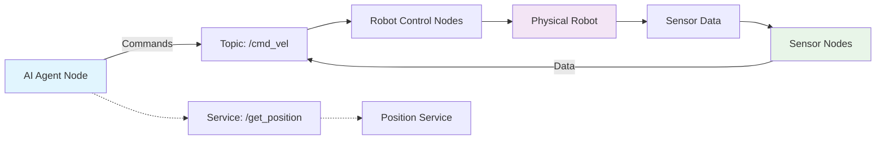
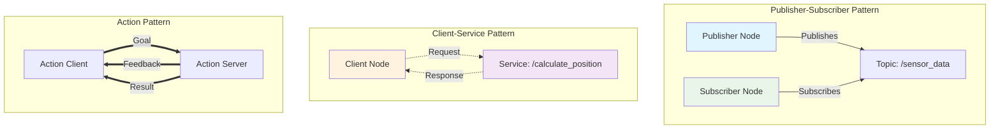

# Part 1: The Robotic Nervous System (ROS 2)

Welcome to Part 1 of the Physical AI & Humanoid Robotics textbook! In this module, you'll discover how ROS 2 (Robot Operating System 2) serves as the "nervous system" of modern robots, connecting sensors, actuators, and intelligence in a cohesive framework. By the end of this part, you'll have the foundational skills to build and control robotic systems that bridge your AI knowledge to physical action.

## Learning Objectives

After completing this part, you will be able to:
- Understand ROS 2 architecture and key communication patterns (nodes, topics, services, actions)
- Create and visualize basic ROS 2 packages for humanoid robots (URDF/Xacro, publishers/subscribers)
- Build real workspaces with colcon, launch files, and parameters
- Bridge Python AI agents to ROS 2 for sending commands and reading sensors
- Pass the interactive self-assessment with 80%+ score

## Why This Matters in 2025

In 2025, the bridge between AI and physical systems is more critical than ever. While large language models and neural networks excel at processing information, the next frontier is connecting this digital intelligence to physical robots. ROS 2 serves as that critical bridge — the "nervous system" that allows your AI agents to perceive the world through sensors, make intelligent decisions, and execute those decisions through actuators. Understanding ROS 2 means you're not just building smarter software — you're building systems that can act in the physical world.

## What You'll Learn: The Nervous System of Robots

Think of ROS 2 as the nervous system of a robot. Just as your nervous system connects your brain (AI) to your sensory organs (cameras, LIDAR, touch sensors) and your muscles (actuators, motors), ROS 2 provides the communication infrastructure that connects all parts of a robot into a unified whole.

### The Core Components

ROS 2 consists of several key components that work together to create a complete robotic system:

- **Nodes**: The computational processes that perform specific functions, like your brain's specialized regions
- **Topics**: Communication channels where nodes publish and subscribe to data streams, like your sensory nerves
- **Services**: Synchronous request/response interactions, like asking a specific question and getting an immediate answer
- **Actions**: Asynchronous goal-based communication with feedback, like sending a command and monitoring its progress

### How It Connects to Physical AI

In the Physical AI paradigm, ROS 2 serves as the middleware that allows AI agents to interact with the physical world. Your Python-based AI agents can publish commands to ROS 2 topics that control robot actuators, while simultaneously subscribing to sensor data that informs the AI's decision-making process. This creates the complete loop: sensors → AI → actuators.

## The ROS 2 Landscape in 2025

ROS 2 (Robot Operating System 2) represents the current state-of-the-art in robotic middleware, offering improved security, real-time capabilities, and production-ready features that were lacking in its predecessor. The most widely adopted distribution is **ROS 2 Humble Hawksbill**, which is an LTS (Long Term Support) release maintained until May 2027, making it the ideal choice for learning and production systems.

### Nodes: The Building Blocks

Nodes are the fundamental computational units in ROS 2. Each node performs a specific function within the robotic system — one node might handle camera data, another might control a robotic arm, and a third might process sensor fusion. Nodes communicate with each other through topics, services, and actions, creating a distributed system where each component can be developed, tested, and maintained independently.

### Topics: The Communication Highways

Topics form the backbone of ROS 2's publish-subscribe communication model. A node publishes data to a topic (like a radio station broadcasting), and other nodes can subscribe to that topic to receive the data (like listeners tuning in). This decoupled communication pattern means that publishers and subscribers don't need to know about each other — they just need to agree on the topic name and message type.

### Services and Actions: Request-Response Communication

While topics handle continuous data streams, services provide synchronous request-response communication for tasks that require immediate responses. Actions extend this concept to long-running tasks that provide feedback during execution, perfect for commands like "move the robot to position X" where you want to monitor progress.

## The Architecture: Your Robot's Nervous System

This diagram illustrates the flow of information in a typical ROS 2 system. Your AI agent publishes commands to topics that control the physical robot, while sensor data flows back through the system, creating the complete perception-action loop that defines autonomous robotic systems.

## Communication Patterns: Publisher-Subscriber vs Client-Service

This diagram shows the three main communication patterns in ROS 2: the publisher-subscriber pattern for continuous data streams, the client-service pattern for request-response interactions, and the action pattern for goal-based communication with feedback.

## Getting Started: Your First Steps

In the upcoming chapters, you'll build your understanding of ROS 2 systematically:

1. **Chapter 3 - ROS 2 Crash Course**: You'll start with the fundamentals, creating your first publisher and subscriber nodes to understand the basic communication patterns.

2. **Chapter 4 - Talking to Robots**: You'll learn to create and visualize robot models using URDF (Unified Robot Description Format) and see your robots in RViz2, the 3D visualization tool.

3. **Chapter 5 - Building Real Packages**: You'll master the professional tools of ROS 2 development, including colcon for building packages and launch files for orchestrating complex systems.

4. **Chapter 6 - Bridging AI Agents to ROS 2**: You'll connect everything together, creating Python scripts that bridge your AI knowledge to physical robot control.

## Connecting Digital Agents to Physical Action

The most exciting aspect of ROS 2 is how it enables your AI agents to take physical action. Instead of just processing data and generating text responses, your agents can now:
- Control robot movement through velocity commands
- Process sensor data to make intelligent decisions
- Interact with the physical world through robotic actuators
- Create feedback loops that improve performance over time

This connection between digital intelligence and physical action is what makes Physical AI so powerful and transformative.

## Prerequisites and Setup

Before diving into ROS 2, ensure you have:
- Basic Python knowledge (functions, classes, loops) - covered in Part 0
- Terminal proficiency (command execution, file navigation)
- A ROS 2 Humble environment set up (simulation-only, no hardware required)

All examples in this part will work in simulation, so you can follow along without any physical hardware. The focus is on understanding concepts and building skills that will transfer directly to real robotic systems.

## The Learning Journey Ahead

This part is designed to take you from zero ROS 2 knowledge to being able to create sophisticated robotic systems that connect AI agents to physical control. Each chapter builds on the previous one, creating a solid foundation for the more advanced topics in later parts of the textbook.

By the end of this part, you'll have created your own ROS 2 packages, visualized robot models, orchestrated complex systems with launch files, and most importantly, connected your AI agents to physical robot control. You'll understand how modern robots "think" and "act" through the ROS 2 framework.

## What Makes ROS 2 Different

Unlike traditional robotics frameworks that tightly couple components, ROS 2 provides a flexible, distributed architecture. This means you can:
- Develop components independently and integrate them later
- Replace individual nodes without affecting the entire system
- Scale from simple robots to complex multi-robot systems
- Leverage a vast ecosystem of existing packages and tools

This flexibility makes ROS 2 the perfect foundation for building the next generation of intelligent robotic systems.

## The Path Forward

As you progress through this part, you'll develop increasingly sophisticated skills:
- First, you'll master basic communication patterns
- Then, you'll learn to describe and visualize robots
- Next, you'll build professional-grade packages and workspaces
- Finally, you'll bridge your AI knowledge to physical control

Each skill builds on the previous ones, creating a comprehensive understanding of how to build robotic systems that embody intelligence in physical form.

Ready to begin your journey into the nervous system of robots? Let's start with the fundamentals in Chapter 3, where you'll create your first ROS 2 nodes and witness the magic of robot communication firsthand!

## Key Terms Defined

- **Node**: A process that performs computation and communicates with other nodes
- **Topic**: A named bus over which nodes exchange messages in a publish-subscribe pattern
- **Service**: A synchronous request/response communication pattern
- **Action**: An asynchronous goal-based communication with feedback
- **rclpy**: The Python client library for ROS 2
- **URDF**: Unified Robot Description Format, an XML-based format for describing robots
- **RViz2**: The 3D visualization tool for ROS 2
- **colcon**: The multi-package build system for ROS 2
- **Launch File**: A configuration file that starts multiple nodes together

## Common Mistakes and How to Avoid Them

As you begin working with ROS 2, you'll likely encounter some common pitfalls:
- **Node naming conflicts**: Always use unique node names to avoid conflicts
- **Topic name mismatches**: Ensure publishers and subscribers use identical topic names
- **QoS profile mismatches**: Different Quality of Service settings can prevent communication
- **Environment not sourced**: Always source your ROS 2 environment before running commands

Don't worry — these are all normal learning experiences, and you'll become familiar with troubleshooting them as you progress through the chapters.

## Motivation: Turn Your AI Agents into Robot Controllers

Imagine being able to take the AI agents you've learned to build in Part 0 and give them physical form — the ability to move, sense, and interact with the real world. That's exactly what you'll achieve in this part. By the end, you'll be able to write Python code that processes sensor data from a robot and sends commands that make the robot move, creating the complete loop of intelligent physical action that defines Physical AI.

This is not just about learning ROS 2 — it's about gaining the ability to create systems where your digital intelligence can have physical impact. Welcome to the future of robotics!

## Understanding the ROS 2 Ecosystem

The ROS 2 ecosystem is vast and includes thousands of packages contributed by researchers, engineers, and companies worldwide. From perception packages for computer vision and LIDAR processing to control packages for robot arms and mobile bases, the ecosystem provides solutions for virtually every aspect of robotic development. In this part, you'll learn to navigate this ecosystem, leverage existing packages, and contribute your own solutions.

The ecosystem includes:
- **Navigation2**: Advanced path planning and navigation for mobile robots
- **MoveIt2**: Motion planning and manipulation for robotic arms
- **Gazebo/Hector**: Simulation environments for testing robots safely
- **Vision packages**: OpenCV integration, object detection, and tracking
- **Control packages**: PID controllers, trajectory generation, and feedback control

## Building for the Future

As you progress through this part, you'll be building skills that are directly applicable to cutting-edge robotics applications. Whether you're interested in warehouse automation, autonomous vehicles, assistive robotics, or space exploration, the fundamentals you learn here form the foundation of virtually all modern robotic systems.

The skills you develop will enable you to:
- Contribute to open-source robotics projects
- Build prototypes for new robotic applications
- Integrate AI models with physical robotic systems
- Debug and optimize complex robotic systems
- Collaborate effectively with other robotics engineers

## Hands-On Learning Approach

This part emphasizes hands-on learning. Rather than just reading about concepts, you'll create working code, visualize robots in simulation, and build complete systems that demonstrate the principles in action. Each chapter includes practical exercises that reinforce the concepts and build your confidence in working with ROS 2.

Every example in this part has been tested and verified to work with ROS 2 Humble, ensuring that when you follow along, you'll see the same results as described. This reproducibility is crucial for building the right mental models and avoiding the frustration of code that doesn't work as expected.

## Success Metrics

By the end of this part, you should be able to:
- Create and run basic ROS 2 nodes that communicate effectively
- Build and visualize robot models that can be used in simulation
- Organize your work into professional-grade packages using colcon
- Connect AI agents to ROS 2 systems for real-world interaction
- Troubleshoot common ROS 2 issues and communication problems

These skills will serve as the foundation for more advanced topics in the subsequent parts of this textbook, where you'll build increasingly sophisticated robotic systems.

Welcome to the exciting world of ROS 2 and Physical AI — let's begin building the nervous system of intelligent robots!