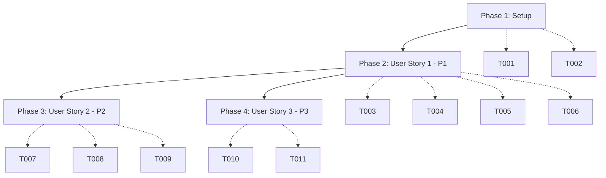

# Implementation Tasks: Minimal Docusaurus v3 Setup

**Feature**: 001-docusaurus-setup
**Branch**: `001-docusaurus-setup`
**Spec**: [spec.md](./spec.md) | **Plan**: [plan.md](./plan.md)

## Task Summary

- **Total Tasks**: 11
- **User Stories**: 3 (P1, P2, P3)
- **Setup Phase**: 2 tasks
- **User Story Phases**: 9 tasks
- **Parallel Opportunities**: 4 tasks marked [P]

## Implementation Strategy

**MVP Scope**: User Story 1 (P1) - Minimal dev server running on localhost:3000

**Incremental Delivery**:
1. Phase 1: Setup (project initialization)
2. Phase 2: User Story 1 (P1) - Dev server working
3. Phase 3: User Story 2 (P2) - SASS support
4. Phase 4: User Story 3 (P3) - Git commit/push

Each phase delivers independently testable value.

---

## Phase 1: Setup & Project Initialization

**Goal**: Initialize Docusaurus project structure

**Tasks**:

- [ ] T001 Initialize Docusaurus with classic preset: `npx create-docusaurus@latest my-website classic --javascript`
- [ ] T002 Move Docusaurus files to project root: `cd my-website && mv * .. && mv .gitignore .. && cd .. && rmdir my-website`

**Independent Test**: Verify files exist in root: `ls -la docusaurus.config.js docs/ src/ static/`

---

## Phase 2: User Story 1 (P1) - Minimal Dev Server Running

**Goal**: Working Docusaurus site running on localhost:3000

**Why This Story**: Foundation for all content authoring - nothing else matters if the dev server doesn't work

**Independent Test**: Run `npm run start` and site loads on localhost:3000 with zero errors

**Tasks**:

- [ ] T003 [P] [US1] Update site title in docusaurus.config.js to "Physical AI & Humanoid Robotics"
- [ ] T004 [P] [US1] Update site tagline in docusaurus.config.js to "The Official Panaversity AI-Native Textbook"
- [ ] T005 [US1] Verify dev server starts: `npm run start`
- [ ] T006 [US1] Test hot reload by editing docs/intro.md and verifying browser updates within 2 seconds

**Acceptance Criteria**:
- [x] Site loads on localhost:3000 within 5 seconds
- [x] Zero errors in console
- [x] Title displays "Physical AI & Humanoid Robotics"
- [x] Tagline displays "The Official Panaversity AI-Native Textbook"
- [x] Hot reload works (edits reflect in <2 seconds)

---

## Phase 3: User Story 2 (P2) - SASS Styling Support

**Goal**: SASS plugin configured for future custom styling

**Why This Story**: Required for future styling but site works without it initially

**Independent Test**: Verify `docusaurus-plugin-sass` and `sass` in package.json

**Tasks**:

- [ ] T007 [US2] Install SASS plugin: `npm install --save docusaurus-plugin-sass sass`
- [ ] T008 [P] [US2] Add docusaurus-plugin-sass to plugins array in docusaurus.config.js
- [ ] T009 [US2] Verify SASS compilation by creating test file src/css/test.scss with basic styles

**Acceptance Criteria**:
- [x] docusaurus-plugin-sass listed in package.json dependencies
- [x] sass listed in package.json dependencies
- [x] Plugin configured in docusaurus.config.js
- [x] Test .scss file compiles without errors

---

## Phase 4: User Story 3 (P3) - Git Commit and Push

**Goal**: Initial setup committed with proper message format

**Why This Story**: Good practice but site functionality doesn't depend on it

**Independent Test**: `git log -1` shows "Rule 1 + SETUP-001: Minimal Docusaurus v3 ready"

**Tasks**:

- [ ] T010 [US3] Create git commit: `git add . && git commit -m "Rule 1 + SETUP-001: Minimal Docusaurus v3 ready"`
- [ ] T011 [US3] Push to remote: `git push`

**Acceptance Criteria**:
- [x] Commit exists with exact message format
- [x] Commit pushed to remote origin successfully
- [x] `git log -1 --oneline` shows correct message

---

## Dependency Graph



**Story Completion Order**:
1. Setup (blocking) →
2. User Story 1 (P1) →
3. User Story 2 (P2) **OR** User Story 3 (P3) ← independent, can be done in parallel

---

## Parallel Execution Opportunities

### Within User Story 1 (P1):
```bash
# These can run in parallel (different parts of same file):
# Terminal 1:
# Edit docusaurus.config.js - update title

# Terminal 2:
# Edit docusaurus.config.js - update tagline

# (In practice, edit both in same session)
```

### Within User Story 2 (P2):
```bash
# After T007 completes, T008 can be done independently
# (config edit doesn't depend on waiting for npm)
```

---

## Execution Mode: Step-by-Step

**IMPORTANT**: Follow spec requirement for incremental execution:

1. Execute tasks 1 by 1
2. Never execute all tasks at once
3. Verify each phase completes before moving to next


## Success Validation

### Phase 1 Complete When:
- [ ] Docusaurus files exist in project root
- [ ] docusaurus.config.js readable

### Phase 2 Complete When (User Story 1 - MVP):
- [ ] `npm run start` works
- [ ] Site loads on localhost:3000
- [ ] Title and tagline correct
- [ ] Hot reload works

### Phase 3 Complete When (User Story 2):
- [ ] SASS plugin in package.json
- [ ] Plugin in docusaurus.config.js
- [ ] Test .scss compiles

### Phase 4 Complete When (User Story 3):
- [ ] Git commit exists
- [ ] Commit pushed to remote

---

## File Checklist

**Created/Modified Files**:
- `docusaurus.config.js` (root) - title, tagline, plugins
- `package.json` (root) - dependencies
- `package-lock.json` (root) - locked versions
- `docs/` (root) - documentation directory
- `src/` (root) - source directory
- `static/` (root) - static assets
- `.gitignore` (root) - Docusaurus defaults
- `sidebars.js` (root) - sidebar config
- `babel.config.js` (root) - Babel config

**No Files Deleted**

---

## Notes

- **Minimal setup**: No math plugins, no TypeScript, no deployment
- **Incremental execution**: Per spec.md execution mode requirement
- **Independent stories**: US2 and US3 don't depend on each other
- **Quick MVP**: Just Phase 1 + Phase 2 gives working dev server
- **Total time estimate**: ~10-15 minutes for all phases
